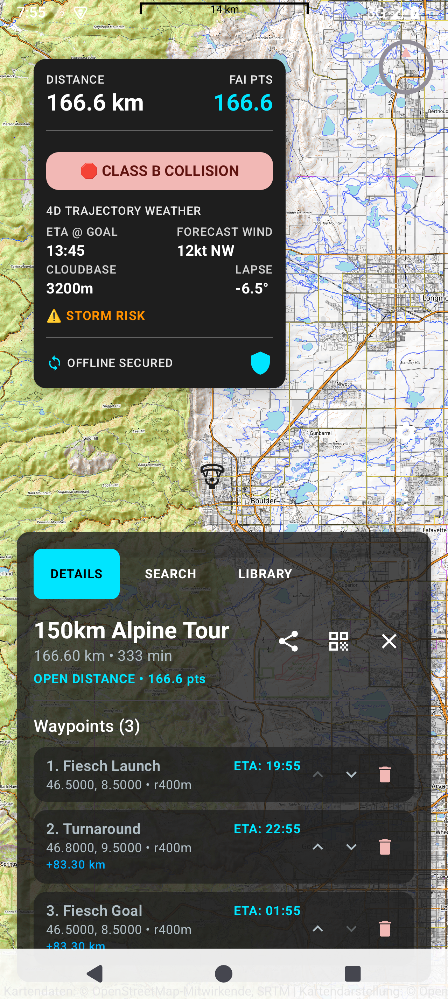
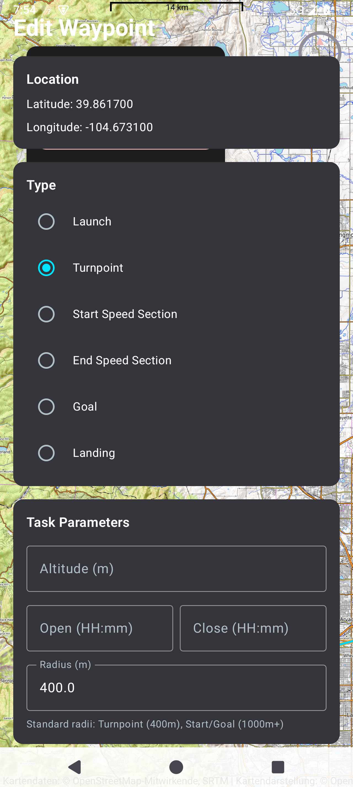
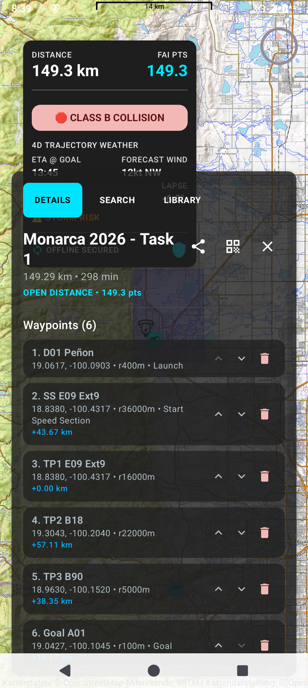
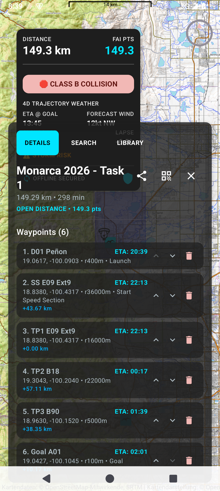

# Tern: The High-Performance Flight Deck

Tern is an advanced, **aviation-grade** flight computer designed specifically for paraglider pilots. Whether you are chasing XC records in the Alps or local thermals at your home site, Tern provides the critical data you need with zero compromise on safety or performance.

## Why Pilots Choose Tern

### ☀️ Glanceable in Any Condition
Optimized for direct sunlight and high-stress environments. Our high-contrast HUD ensure altitude, ground speed, and glide ratio are readable in a split second.

### 📴 Bulletproof Offline Maps
Never worry about losing signal. Tern pre-caches airspaces, waypoints, and topo maps so they are ready the moment you launch. Our high-speed spatial engine ensures the map stays fluid even with thousands of data points.

### 🌦️ Predictive Weather Trajectories
Don't just look at the forecast—see how it affects your flight. Tern analyzes your planned route and overlays 4D weather data (wind and thermal strength) exactly where and when you'll be there.

### ✋ Glove-Friendly Control
Designed for use with thick winter gloves. Massive touch targets and haptic feedback ensure every interaction is confirmed, even in turbulent conditions.

## Key Features

- **Live Wind Gauges**: Real-time wind speed and direction indicators directly on your map.
- **Smart Airspace Alerts**: Intelligent decluttering that only shows relevant airspaces based on your altitude and heading.
- **Thermal Assistant**: Visualizes heat cores to help you center and climb faster.
- **Flight Logs**: Automatic synchronization of your flights for review and sharing.

## Built for the Heat of Competition

Tern isn't just a flight deck; it's your tactical advantage. Experience how the world's best pilots use Tern, illustrated here with **Task 1 of the 2026 Monarca Paragliding Open** in Valle de Bravo, Mexico.

### 🏁 Tactical Route Planning
Define complex competition tasks with ease. Tern handles Speed Sections (SSS/ESS), time gates, and varying cylinder radii (from 400m launch cylinders to 36km start gates) while you focus on the line.

*Real screenshot: Task 1 definition at the 2026 Monarca Open. Note the varied cylinder radii and clear waypoint sequencing.*

### 🛡️ Aviation-Grade Safety
Fly with confidence. Tern's proactive collision detection monitor identifies potential airspace infringements in 4D—predicting your trajectory against real-time airspace boundaries.

*Real screenshot: Tern alerting the pilot to a potential Class B airspace infringement while calculating ETA to the Goal.*

### 🌦️ Predictive Weather Trajectories
Get precise forecasts exactly where you'll be. Tern analyzes your planned route and overlays 4D weather data (wind and thermal strength) exactly where and when you'll be there.

*Real screenshot: High-fidelity HUD showing distance to the next Speed Section and tactical point calculations.*

---

## Technical Excellence

If you are a developer looking to contribute to the high-performance core of Tern, please see our [TECHNICAL.md](file:///home/raghu/src/Tern/TECHNICAL.md) guide.

---

*Fly safe. Fly Tern.*
