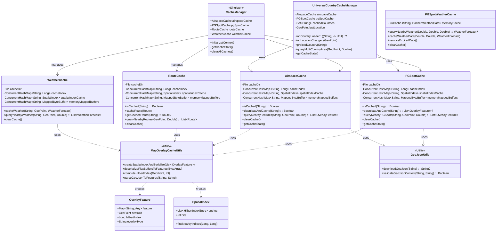
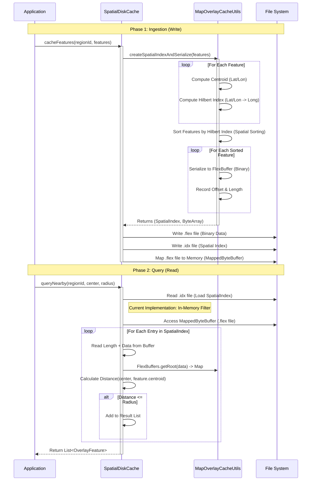

# Caching System Architecture

This document provides a high-level overview of the caching system used in the Tern application, specifically for map overlays like PG Spots and Airspaces.

## Class Diagram

## Key Components

### 1. CacheManager
The central singleton registry that holds references to all specific cache implementations. It ensures lazy initialization and provides a single point of access for clearing caches or gathering statistics.

### 2. UniversalCountryCacheManager
The orchestrator for location-based data loading. It monitors the user's location, determines the current country, and triggers `downloadAndCache` on the specific caches (`PGSpotCache`, `AirspaceCache`) for that country. It also manages preloading of adjacent countries.

### 3. PGSpotCache, AirspaceCache, RouteCache, & WeatherCache
Specific implementations for different data types. They share a common architecture (except `PGSpotWeatherCache`):
*   **Storage**: Data is stored in **Real FlexBuffers** (binary format) for high-performance serialization and deserialization.
*   **Indexing**: A Hilbert Curve spatial index is used to map 2D geospatial coordinates to a 1D index.
*   **Querying**: Currently uses an **in-memory filtering** approach for correctness. Features are loaded from the binary cache and filtered by distance in memory, bypassing complex Hilbert range queries for now.
*   **Memory Mapping**: Files are memory-mapped (`MappedByteBuffer`) for zero-copy read access during queries.
*   **Downloading**: `PGSpotCache` and `AirspaceCache` handle fetching data from their respective APIs via `GeoJsonUtils`. `RouteCache` and `WeatherCache` are primarily populated by the app's logic.

### 4. PGSpotWeatherCache
A specialized in-memory cache for weather data associated with specific PG spots.
*   **Storage**: Uses an `LruCache` to store `CachedWeatherData` objects in memory.
*   **Indexing**: Uses a simplified on-the-fly Hilbert index approximation for spatial lookups.
*   **Expiration**: Implements strict expiration policies (2 hours for current weather, 12 hours for forecasts) to ensure safety.

### 5. MapOverlayCacheUtils
A utility class that handles the heavy lifting of:
*   Parsing GeoJSON.
*   Computing Hilbert indices.
*   Serializing features to the binary format.
*   Creating the `SpatialIndex`.

### 6. GeoJsonUtils
Handles network requests to download GeoJSON data, with built-in validation and timeouts.

## Data Flow & Control Logic

The following diagram illustrates the lifecycle of data within the `SpatialDiskCache`, from ingestion (download & write) to retrieval (query).

