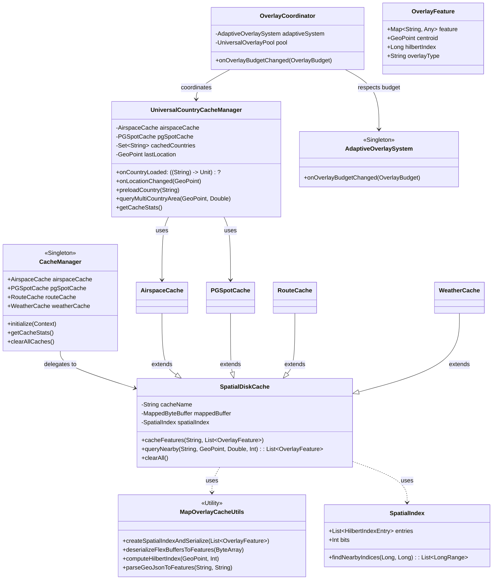

# Caching System Architecture

This document provides a high-level overview of the caching system used in the Tern application, specifically for map overlays like PG Spots and Airspaces.

## Class Diagram



## Single Source of Truth (SSOT)

The caching system adheres to the **Source of Truth** skill by clearly defining ownership:

1.  **Disk-Based Feature Data**: `SpatialDiskCache` is the SSOT for all serialized map features. Individual caches (Airspace, PGSpot) are typed wrappers around this generic engine to ensure consistent indexing and storage logic.
2.  **Resource Allocation**: `AdaptiveOverlaySystem` is the SSOT for memory and object budgets. It calculates the `OverlayBudget` based on device performance, which the `OverlayCoordinator` then propagates to all active managers and caches.
3.  **Country/Region Boundary**: `UniversalCountryCacheManager` is the SSOT for determining which geographical regions are currently active and loaded.

## Key Components

### 1. SpatialDiskCache
The core generic engine for spatial storage.
*   **Storage**: Data is stored in **FlexBuffers** (binary format) for zero-copy deserialization.
*   **Indexing**: Uses a **Hilbert Curve** (16-bit precision) to map 2D coordinates to a 1D index, enabling efficient spatial clustering on disk.
*   **Memory Mapping**: Files are memory-mapped (`MappedByteBuffer`) to allow the OS to manage caching while providing the app with instant access to any feature without full heap hydration.

### 2. Hilbert Range Queries & Lazy Hydration
Queries follow a two-stage "Prune and Filter" strategy:
1.  **Pruning**: `SpatialIndex.findNearbyIndices` calculates Hilbert ranges that cover the search area. This limits the search to small, contiguous chunks of the file.
2.  **Lazy Hydration**: The system "peeks" at the feature's centroid from the buffer. It only performs full FlexBuffer hydration into a `Map` if the feature is within the exact distance threshold.
3.  **Adaptive Budgeting**: All queries respect a `limit` provided by the `AdaptiveOverlaySystem` to prevent UI lag during density spikes.

### 3. UniversalCountryCacheManager
The orchestrator for location-based data loading. It determines the current country and triggers preloading of adjacent regions. It relies on the generic `SpatialDiskCache` for each data type.

## Data Flow & Control Logic

```mermaid
sequenceDiagram
    participant App as OverlayCoordinator
    participant Cache as SpatialDiskCache
    participant Index as SpatialIndex
    participant Disk as File System (Mapped)

    note over App, Disk: Spatial Query Flow
    App->>Cache: queryNearby(center, radius, limit)
    
    Cache->>Index: findNearbyIndices(centerIndex, range)
    Index-->>Cache: List<LongRange> (Hilbert Pruning)
    
    loop For Each Hilbert Range
        loop For Each Index in Range
            Cache->>Disk: Peek Centroid (Zero-Copy)
            Cache->>Cache: Calculate Distance
            alt Distance <= Radius
                Cache->>Disk: Hydrate Full Feature (FlexBuffer)
                Cache->>Cache: Add to Result List
            end
            break if ResultCount >= limit
        end
    end
    
    Cache-->>App: Return Filtered List
```
