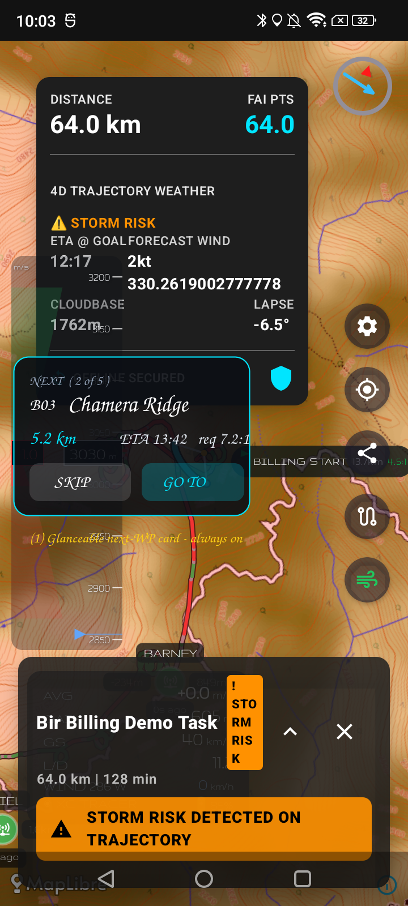
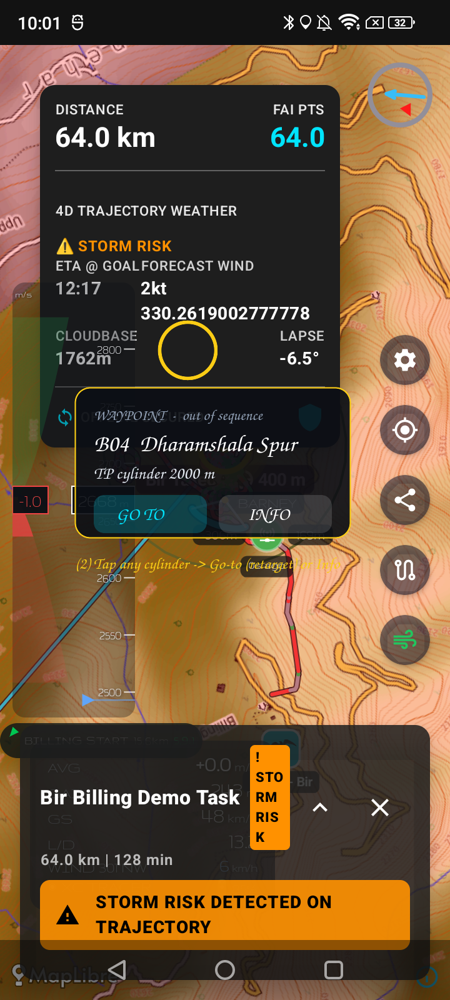
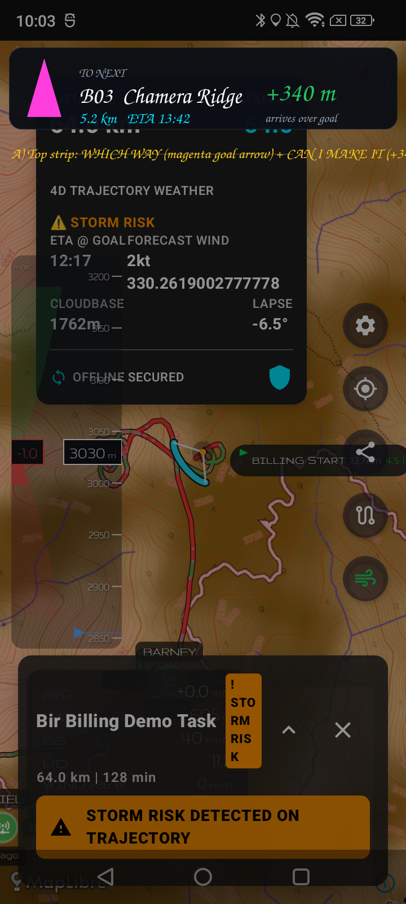
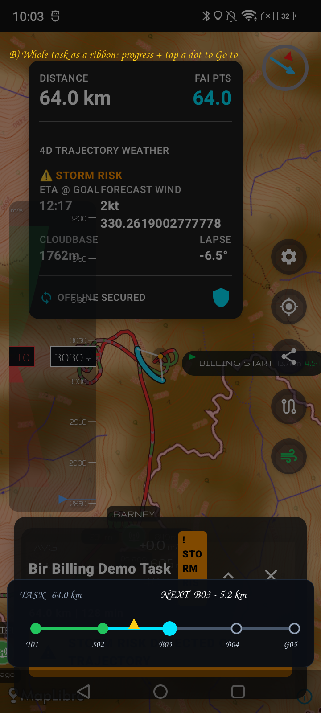
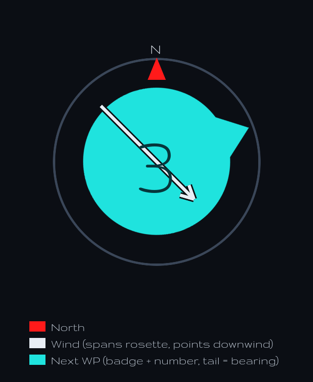

# Design brainstorm: in-flight task interactions

> **Status: BRAINSTORM (2026-06-15) — not approved, not started.** This is for a
> round of discussion before any implementation. Mockups are annotations over
> *real* app screenshots (Bir Billing bench replay) so we can feel the layout.

## What this is about

We have the *passive* half of task navigation working: a task auto-advances its
active waypoint on cylinder entry, the active waypoint is highlighted on-map, and
an off-screen chip points to it with name/description + distance + required glide.

This doc is about the *interactive* half — what the pilot can **do** with a task
**while flying it**, and how that's presented without compromising flight safety.

## Constraints (these drive everything)

In flight the pilot is one-handed (the other is on the brakes), often gloved, in
glare and turbulence, and must keep eyes **outside**. So:

- **Glance beats touch.** The common case ("where am I going, can I make it?")
  must be answered without touching the screen.
- **Big, sparse targets.** Few controls, large hit areas, high contrast.
- **No destructive surprises.** Anything that changes task state should be
  obvious and ideally reversible; confirm only when truly destructive.
- **Feedback on tag.** When a cylinder is tagged, the pilot must *know* (haptic /
  sound / flash) — they can't be staring at the screen to catch it.

## Today (what we build on)

- Auto-advance on cylinder entry (`TaskNavigator` + `TaskProgressOverlay`).
- On-map active-waypoint highlight (`TaskLayer`).
- Off-screen direction chip (`OffScreenWaypointIndicator`).
- **Gap:** the map has **no tap / long-press wiring at all** — tap-to-select a
  waypoint was never connected. That's the foundation for everything touch-based.

## The interaction inventory (proposed)

Three tiers by how often / deliberately they're used:

### A. Glance — zero touch (the 95% case)
On-map highlight + off-screen chip (done) **+ a persistent "Next waypoint" card**
so the answer is always on-screen even when the WP isn't. Candidate content:
name/description, distance, ETA, required glide, progress (2 of 5).

### B. Light touch — occasional overrides
- **Skip / advance** the active waypoint manually (auto-tag missed, or you choose
  to skip a turnpoint). A button on the card.
- **Tap a waypoint on the map → "Go to"** — retarget out of sequence (bailing to
  goal, re-flying a leg). Tap opens a tiny menu rather than retargeting instantly
  (avoids accidental retarget in turbulence).

### C. Deliberate — rare
- Reset / restart task progress; toggle **manual vs auto** advance (comp pilots
  may want manual control around the start gate). Lives behind the task panel or
  a long-press, confirmed.

## Open questions (the brainstorm)

1. **Persistent card — yes/no, and where?** The deck already has the vario HUD
   (bottom), compass (top-right), control dock (right). Does a "Next" card earn
   its space, or is the off-screen chip + on-map highlight enough? If yes — left
   edge? a thin top strip? merged into the vario HUD?
2. **Tap-to-retarget: instant or menu?** In-flight safety says menu ("Go to /
   Info"); fewer taps says instant. Lean: menu.
3. **Skip vs back.** Do we need "revert to previous waypoint" too, or only
   forward-skip? (Reverting matters if an auto-tag fires by mistake.)
4. **Manual mode.** Should auto-advance be defeatable? Most relevant at the start
   gate (you cross the SSS cylinder many times before the gate opens).
5. **Tag feedback.** Haptic buzz + brief on-screen flash on tag? Sound optional
   (varios already beep). This is arguably the highest-value, lowest-cost item.
6. **Card tap action.** Recenter on the active WP? Open its info? Cycle content?
7. **Glove/turbulence target size & placement** vs the existing HUD elements —
   anything that needs to move to make room?

## Tentative phased plan (sequence, not commitment)

- **Phase 0 — Foundation: map tap/long-press → waypoint hit-test → selection.**
  Nothing touch-based works without it; it's also reusable for editing. *(Prereq.)*
- **Phase 1 — Glance + feedback:** the "Next" card (Q1) and tag feedback (Q5).
  Highest safety value, no destructive actions.
- **Phase 2 — Overrides:** skip/advance (Q3) and tap-to-Go-to (Q2).
- **Phase 3 — Deliberate:** reset/restart + manual mode (Q4).

Each phase backed by a claim-driven test (replay a task, assert the pilot-visible
outcome), same as `TaskNavClaimsTest`.

## Direction explorations (v2 — the floating card was too dialog-y)

The first card felt like a dialog bolted onto a busy screen. These two are
instrument-native and complementary (not either/or):

### A — Top nav strip: "which way + can I make it?"
A slim header: a magenta **goal arrow** (fly toward it), the next waypoint, the
distance/ETA, and the **arrival height** colour-coded (green = arrives above the
cylinder, red = won't make it). Answers the two in-flight questions in one glance,
reusing language pilots know (goal pointer + final glide). No floating box.

### B — Task ribbon: "where am I in the task?"
The whole task as a transit-style progress bar along the bottom: a dot per
waypoint, completed legs green, current leg cyan, a "you-are-here" marker, next
WP + distance. **Tap a dot to Go to** it (retarget) — interaction lives on the
thing itself, no popup.

**They combine well:** A is the always-on glance (direction + final glide); B is
the tappable overview + retarget surface (could be collapsed to a thin bar,
expanding on tap). Together they replace both the floating card *and* the
tap-popup from v1.

Still open: exact placement vs the vario HUD / compass, whether the goal arrow
should instead live *on* the compass rose, and whether B is always-visible or
pull-up.

## Decisions (round 2, 2026-06-15)

1. **Next-waypoint arrow lives on the compass rosette** (not a separate strip),
   and must be **clearly differentiated from the wind needle** — by colour
   (magenta vs blue), weight (thick vs thin), and direction (the WP arrow is a
   bold ray pointing *out* to the bearing; the wind needle is a thin line
   streaming *in* downwind).
2. **Drop "goal" entirely.** Only the **next waypoint** matters. Direction +
   final glide are always to the next waypoint's cylinder.
3. **The task overview (ribbon, B) opens from the Task button** — a deliberate
   button press, not a drag-up-anywhere gesture. In flight a stray drag is too
   easy; a button is reliable with gloves and won't fire by accident.
4. **Final glide comes from a glider profile in pilot settings** (see below),
   the way XCTrack/others do it — not a hand-set glide ratio.

The compass rosette carries **three** elements, each unmistakable:
1. **North** — the red carat.
2. **Wind** — an **amber** arrow that **spans the whole rosette** (rim → through
   centre → opposite rim), arrowhead pointing downwind, with a dark casing.
   Amber is the near-complement of the cyan badge → maximum contrast; the red
   north carat is a small distinct shape, so the three never blur together.
3. **Next waypoint** — a **cyan circular badge** that fills the rosette with the
   **bold, high-contrast number centred** and a **pointed tail** that
   rotates so it **points the bearing**. (N carat + wind arrow overlay on top.)

So the v2 split becomes:
- **A → folds into the compass** (mockup C) + a small readout (next WP name,
  distance, arrival height colour-coded). *Open: where the readout sits — under
  the compass, or a short line in the HUD.*
- **B → the Task button opens** the task ribbon/overview; tap a dot to Go to.

## Final glide via glider profile  — ⏸ DEFERRED (backlog)

> **Parked 2026-06-15.** Final glide / L/D and the glider profile are deferred —
> taken up later. The compass + tap interactions ship without arrival height; the
> next-WP readout shows **name + distance only** for now (no green/red "can I
> make it" number until this lands).

Pilots shouldn't type a glide ratio. Instead:
- **Pilot settings → Glider:** pick your wing from a bundled database and enter
  all-up weight; we look up its glide performance.
- Reference pilot/wing for testing: **Niviuk Klimber 3P (85–105 kg), flown at
  ~92 kg all-up.**
- **Arrival height** to the next cylinder = current altitude − distance / glide
  ratio, **wind-corrected** (head/tail wind changes effective glide a lot — we
  already have a live wind estimate, so fold it in). Colour green if it clears
  the cylinder, red if not.

**Open questions on the glide model:**
- Fidelity: a single **best glide ratio** per wing (simple, good enough at trim)
  vs a full **speed-to-fly polar** (accurate across bar settings, much more data
  per wing). Lean: start with best-L/D + wind correction; polar later.
- **Data source** for the glider DB: bundled table keyed by model (seed with
  common EN wings + the Klimber 3P), defaulting by EN class when a wing is
  unknown, user-overridable.
- Where the glider profile lives: a new **Pilot** section in Settings (alongside
  Connections / Units).

## Updated phase plan
- **Phase 0 — map tap/long-press → waypoint hit-test → selection** (prereq).
- **Phase 1 — compass next-WP arrow** (mockup C) + tag feedback (haptic/flash) +
  next-WP readout (**name + distance**; no arrival height yet).
- **Phase 2 — Task button opens the ribbon; tap a dot to Go to;** manual
  skip/advance.
- **Phase 3 (DEFERRED) — Pilot/glider profile + final-glide arrival readout** (the
  green/red "can I make it" number). Backlog; taken up later.

Each phase backed by a claim-driven test. Nothing built yet — still brainstorm.
