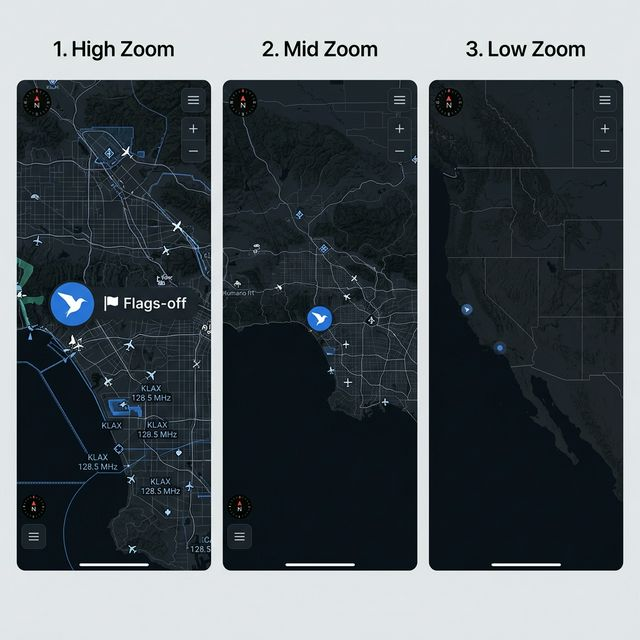
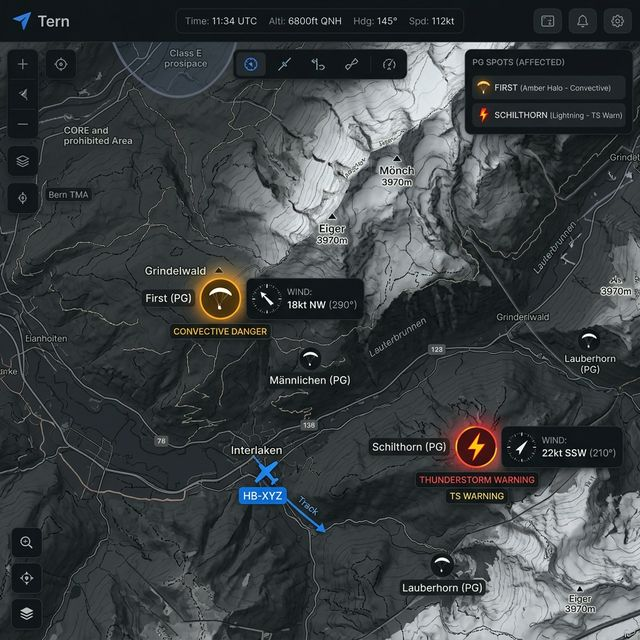

# RFC 005: PGSpot Visualization Enhancements

> **Status: Archived.** This RFC was designed for OSMDroid bitmap caching.
> MapLibre handles icon scaling natively via `iconSize` interpolation
> expressions. The approach described here is architecturally obsolete.

## Date: 2026-03-18

## 1. Problem Statement
At regional/continental zoom levels (Zoom < 6), PGSpot icons become disproportionately large, obscuring map detail and reducing situational awareness. Additionally, static icons provide limited value compared to dynamic weather data.

## 2. Proposed Solution

### 2.1 Native Dynamic Scaling
Use the Tern bird icon (`ic_launcher`) with a 3-stage adaptive scaling model:
- **High Zoom (> 10)**: 100% Size + Site Label.
- **Mid Zoom (6 - 10)**: 60% Size, No Label.
- **Low Zoom (< 6)**: 20% Size, 40% Alpha ("Pin-Prick").

### 2.2 Zone-Aware Weather & Hazards
Restrict advanced weather visualizations to `CORE` and `NEAR` zones (approx 100-400km) to optimize performance and battery life.
- **Wind Gauges**: Dynamic direction/speed icons.
- **Hazard Halos**: Amber halos for convective danger.
- **Lightning Bolts**: Critical warnings for thunderstorms.

## 3. Implementation Details
- **Adaptive Refresh**: Refresh scaling factor on significant zoom changes (>0.5).
- **Zone Filtering**: Limit weather API synchronizations to active `CORE`/`NEAR` spots.
- **Icon Partitioning**: Cache scaled bitmaps in a zoom-aware LruCache.
