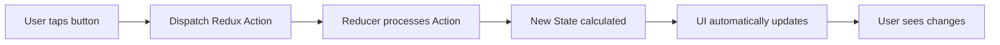
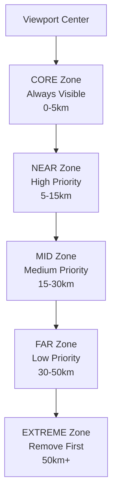
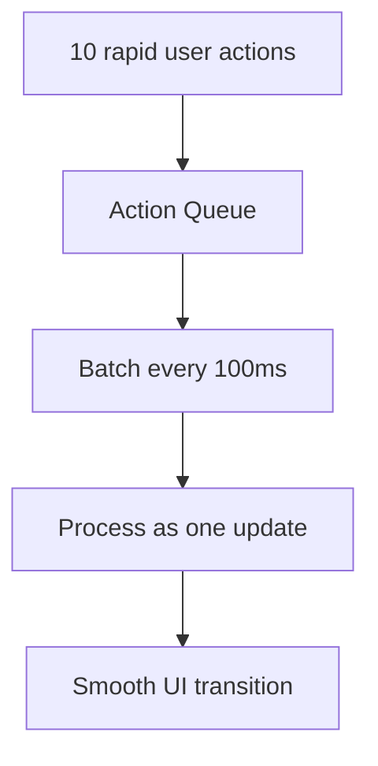
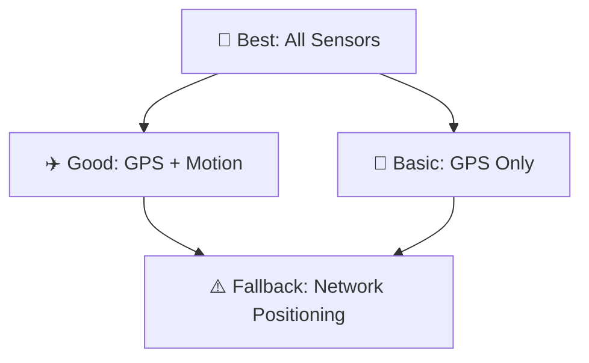

# 🏗️ Tern Paragliding App - Architecture Decisions

## 📋 Overview
This document explains the core architectural decisions that make Tern a safe, performant, and maintainable aviation application.

## 🎯 Core Architecture Principles

### One Source of Truth
**Problem**: Multiple components managing the same data leads to conflicts and bugs.

**Solution**: Redux Store as the single source of truth for all application state.

```
┌─────────────────────────────────────┐
│           Redux Store              │ ← Single Source
│        (MapState + WeatherState)   │
├─────────────────────────────────────┤
│ ✅ Map location & viewport data     │
│ ✅ Overlay visibility & config      │
│ ✅ Weather data & forecasts        │
│ ✅ User settings & preferences     │
└─────────────────────────────────────┘
         │
         ▼ All UI components read from here
```

**❌ WRONG:**
```kotlin
// Different components manage same data
class MapView { var userLocation: GeoPoint? = null }
class WelcomeScreen { var userLocation: GeoPoint? = null } // Conflict!
```

**✅ CORRECT:**
```kotlin
// Single Redux store manages all state
val state by store.state.collectAsState()
// All components read from same source
```

## 🗂️ Redux State Management Pattern

### Simple Flow Explanation


### Redux Pattern in Code
```kotlin
// 1. Action = "What happened"
sealed class MapAction {
    data class UpdateLocation(val location: GeoPoint) : MapAction()
    object RequestLocationPermission : MapAction()
}

// 2. State = "Current condition"
data class MapState(
    val userLocation: GeoPoint? = null,
    val isLocationReady: Boolean = false
)

// 3. Reducer = "How state changes"
fun mapReducer(state: MapState, action: MapAction): MapState {
    return when (action) {
        is MapAction.UpdateLocation ->
            state.copy(userLocation = action.location)
        is MapAction.RequestLocationPermission ->
            state.copy(permissionRequested = true)
    }
}

// 4. Store = "Manages everything"
class MapStore : ViewModel() {
    private val _state = MutableStateFlow(MapState())
    val state = _state.asStateFlow()

    fun dispatch(action: MapAction) {
        _state.value = mapReducer(_state.value, action)
    }
}
```

## 🎨 Overlay Management Architecture

### Distance-Based Zoning System


### BaseOverlayManager Pattern
```kotlin
abstract class BaseOverlayManager(
    private val overlayType: OverlayType,
    private val store: MapStore
) {
    // ✅ DO: Use Redux for state coordination
    protected fun dispatch(action: MapAction) {
        store.dispatch(action)
    }

    // ✅ DO: Respond to state changes
    abstract fun onReduxStateChanged(state: MapState)

    // ❌ DON'T: Direct overlay manipulation
}
```

## ⚡ Performance Optimization Patterns

### Batch Processing for Smooth Updates


**Performance Targets:**
```
🚀 Speed: <10 Redux dispatches per second
💾 Memory: <75% of available heap
🎯 Smooth: 60fps UI updates
🔄 Efficient: Batch similar operations together
```

## 🛡️ Aviation Safety Standards

### Progressive Enhancement Strategy


## 🚦 Success Metrics

### Technical Success (Mandatory)
- [ ] **Code Quality**: Zero compilation errors or warnings
- [ ] **Performance**: <10 dispatches/sec, <75% memory usage
- [ ] **Architecture**: 100% Redux compliance, no legacy patterns
- [ ] **Safety**: Zero visual discontinuity during flight operations

### User Experience Success
- [ ] **Problem Resolution**: Original issue completely solved
- [ ] **No Regression**: Existing features unaffected
- [ ] **Progressive Enhancement**: Works for all user types
- [ ] **Clear Benefit**: Improvement obvious to users

---

## 💡 Simple Analogies for Complex Concepts

**Redux = Restaurant Kitchen**
- Store = Kitchen (single source of food)
- Actions = Orders (what customers want)
- Reducers = Chefs (prepare the food)
- Components = Waiters (deliver food to tables)

**Overlay Zones = Theater Seating**
- CORE = Front row (always visible, premium seats)
- NEAR = Middle section (high priority, good view)
- MID = Back section (visible but lower priority)
- FAR = Upper balcony (only when theater not full)
- EXTREME = Outside (removed when theater crowded)

**Batch Processing = Mail Sorting**
- Individual letters = Single Redux dispatches (slow)
- Bundled mail = Batch processing (efficient)
- Sorted bundles = Smooth UI updates (fast delivery)

This architecture ensures Tern remains fast, safe, and maintainable while providing aviation-grade reliability for paragliders.