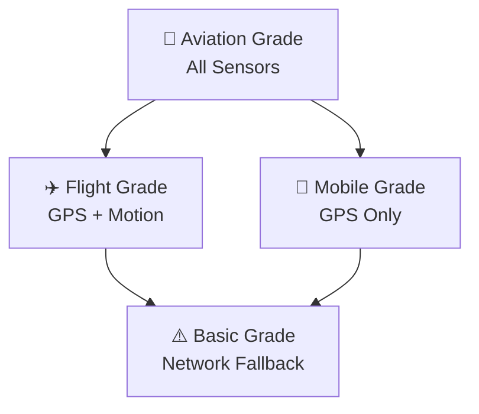

# 🛡️ Aviation Safety Standards

## 📋 Overview
Safety-first architecture for aviation applications.

## 🎯 Core Safety Principles

### Progressive Enhancement Strategy


## 🛡️ Safety Implementation Patterns

### GPS Validation Before Operations
```kotlin
// ✅ GOOD: Validate GPS before map operations
fun performMapMove(center: GeoPoint, zoom: Double) {
    if (!hasValidGPSFix) {
        Log.d(TAG, "No GPS fix yet, postponing operations until GPS available")
        return // Safe fallback
    }

    if (center.isValidCoordinate()) {
        updateMapView(center, zoom)
    }
}

// ❌ BAD: Operate without GPS validation
fun performMapMoveBad(center: GeoPoint, zoom: Double) {
    updateMapView(center, zoom) // Could show wrong location!
}
```

### Smooth Visual Transitions
```kotlin
// ✅ GOOD: Smooth overlay transitions
private fun removeAirspacesSmoothly(airspaceIds: List<String>) {
    airspaceIds.chunked(10).forEachIndexed { index, group ->
        if (index > 0) Thread.sleep(50) // Small delay for smooth transition

        group.forEach { id ->
            removeAirspace(id)
            mapView.invalidate() // Gradual visual update
        }
    }
}

// ❌ BAD: Abrupt removal
private fun removeAirspacesBad(airspaceIds: List<String>) {
    airspaceIds.forEach { removeAirspace(it) }
    mapView.invalidate() // Jarring single update
}
```

## 📊 Sensor Graceful Degradation

### Runtime Capability Detection
```kotlin
data class SensorCapabilities(
    val hasBarometer: Boolean,
    val hasGyroscope: Boolean,
    val hasAccelerometer: Boolean,
    val accuracyLevel: AccuracyLevel
)

fun detectCapabilities(): SensorCapabilities {
    val barometer = sensorManager.getDefaultSensor(Sensor.TYPE_PRESSURE)
    val gyroscope = sensorManager.getDefaultSensor(Sensor.TYPE_GYROSCOPE)
    val accelerometer = sensorManager.getDefaultSensor(Sensor.TYPE_ACCELEROMETER)

    val accuracy = when {
        barometer != null && gyroscope != null -> AccuracyLevel.AVIATION_GRADE
        barometer != null || gyroscope != null -> AccuracyLevel.FLIGHT_GRADE
        accelerometer != null -> AccuracyLevel.MOBILE_GRADE
        else -> AccuracyLevel.BASIC
    }

    return SensorCapabilities(
        hasBarometer = barometer != null,
        hasGyroscope = gyroscope != null,
        hasAccelerometer = accelerometer != null,
        accuracyLevel = accuracy
    )
}
```

### Feature Adaptation by Capability
```kotlin
@Composable
fun AdaptiveFlightDisplay(capabilities: SensorCapabilities) {
    when (capabilities.accuracyLevel) {
        AccuracyLevel.AVIATION_GRADE ->
            FullPrecisionDisplay() // All sensors available

        AccuracyLevel.FLIGHT_GRADE ->
            EnhancedDisplay() // GPS + motion sensors

        AccuracyLevel.MOBILE_GRADE ->
            BasicDisplay() // GPS only

        AccuracyLevel.BASIC ->
            NetworkBasedDisplay() // Fallback mode
    }
}
```

## 🚨 Critical Safety Requirements

### Visual Continuity During Flight
- [ ] **No Jarring Transitions**: Overlay changes must be smooth
- [ ] **Predictable Behavior**: Users can anticipate system responses
- [ ] **Clear Status Indicators**: Users always know system state
- [ ] **Graceful Degradation**: App works with missing sensors

### GPS Safety Validation
```kotlin
data class GpsValidation(
    val hasValidFix: Boolean,
    val accuracyMeters: Float,
    val fixAgeMs: Long,
    val isSafeForAviation: Boolean
)

fun validateGpsForAviation(location: Location?): GpsValidation {
    if (location == null) {
        return GpsValidation(false, 0f, 0L, false)
    }

    val isAccurateEnough = location.accuracy < 20f // <20m for aviation
    val isFreshEnough = location.time > System.currentTimeMillis() - 10000 // <10s old
    val isSafe = isAccurateEnough && isFreshEnough

    return GpsValidation(
        hasValidFix = true,
        accuracyMeters = location.accuracy,
        fixAgeMs = System.currentTimeMillis() - location.time,
        isSafeForAviation = isSafe
    )
}
```

## 🎯 Safety Success Metrics

### Technical Safety
- [ ] **Visual Continuity**: Zero jarring transitions during flight
- [ ] **GPS Validation**: All map operations validated before execution
- [ ] **Progressive Enhancement**: App functional at all capability levels
- [ ] **Error Recovery**: Graceful handling of sensor failures

### User Experience Safety
- [ ] **Predictable Behavior**: Users can anticipate system responses
- [ ] **Clear Feedback**: Status always visible and understandable
- [ ] **No Disorientation**: Smooth transitions prevent confusion
- [ ] **Offline Resilience**: App works without network connectivity

---

## 💡 Aviation Safety Analogies

**Progressive Enhancement = Aircraft Instruments**
- Full panel = All sensors available (best case)
- Partial panel = Some sensors missing (still flyable)
- Basic instruments = Essential sensors only (safe minimum)
- Emergency backup = Network fallback (survivable)

**Smooth Transitions = Aircraft Control**
- Smooth control inputs = Gradual overlay changes (predictable)
- Jerky movements = Abrupt overlay clearing (disorienting)
- Clear instrument readings = Redux state visibility (informative)

**GPS Validation = Pre-Flight Checks**
- Check all systems = Validate GPS before operations
- Verify instruments = Confirm coordinate accuracy
- Confirm readiness = Ensure safe operating conditions

This safety architecture ensures Tern provides aviation-grade reliability and user confidence for paragliding operations.