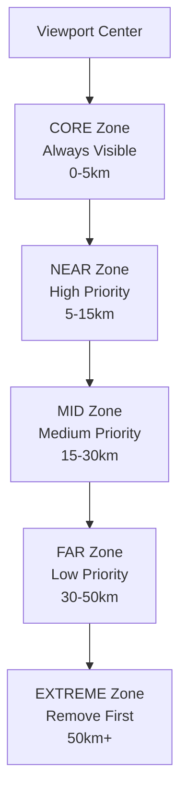

# 🎨 Overlay Management Architecture

## 📋 Overview
How Tern manages map overlays (airspaces, terrain, PG spots) safely and efficiently.

## 🎯 Core Problem Solved
**Before**: Overlays appeared/disappeared abruptly → jarring user experience
**After**: Smooth distance-based transitions → professional aviation-grade UX

## 🏗️ Architecture Pattern

### BaseOverlayManager Foundation
```kotlin
abstract class BaseOverlayManager(
    private val overlayType: OverlayType,
    private val store: MapStore
) {
    // ✅ DO: Use Redux for state coordination
    protected fun dispatch(action: MapAction) {
        store.dispatch(action)
    }

    // ✅ DO: Respond to state changes
    abstract fun onReduxStateChanged(state: MapState)

    // ❌ DON'T: Direct overlay manipulation
}
```

### Distance-Based Zoning System


## 🎨 Implementation Patterns

### AirspaceOverlayManager Example
```kotlin
class AirspaceOverlayManager(
    context: Context,
    store: MapStore
) : BaseOverlayManager(OverlayType.AIRSPACE, store) {

    override fun onReduxStateChanged(state: MapState) {
        if (state.overlayState.airspaces.enabled) {
            loadAirspacesForLocation(state.userLocation)
        } else {
            clearOverlays()
        }
    }

    private fun loadAirspacesForLocation(location: GeoPoint?) {
        location?.let {
            // Query nearby airspaces efficiently
            val features = airspaceCache.queryNearbyFeatures(
                countryCode, it, searchRadiusKm = 200.0
            )
            renderAirspaceFeatures(features)
        }
    }
}
```

### Smooth Clearing Algorithm
```kotlin
private fun manageViewportAirspaces(viewport: BoundingBox) {
    // 1. Classify by distance zones
    val zones = createViewportZones(viewport, center)
    val airspacesByZone = classifyByDistance(airspaces, center, zones)

    // 2. Determine what to remove (distance-based)
    val toRemove = determineRemovalCandidates(airspacesByZone, zones)

    // 3. Remove smoothly (batched with delays)
    removeAirspacesSmoothly(toRemove)
}
```

## ⚡ Performance Patterns

### Zoom-Based Filtering
```kotlin
fun applyZoomBasedFiltering(airspaces: List<Airspace>, zoom: Double): List<Airspace> {
    val maxOverlays = when {
        zoom >= 12.0 -> 100  // High zoom: full detail
        zoom >= 10.0 -> 50   // Medium zoom: half detail
        zoom >= 8.0 -> 25    // Low zoom: quarter detail
        else -> 12           // Very low zoom: essential only
    }

    return airspaces
        .sortedBy { distanceFromCenter(it) }  // Closer first
        .take(maxOverlays)                    // Keep closest
}
```

### Batch Processing for Smooth Updates
```kotlin
// ✅ GOOD: Batch multiple operations
fun updateMultipleOverlays(updates: List<OverlayUpdate>) {
    dispatch(MapAction.BatchOverlayUpdate(updates))
}

// ❌ BAD: Individual operations
fun updateMultipleOverlaysBad(updates: List<OverlayUpdate>) {
    updates.forEach { dispatch(MapAction.SingleOverlayUpdate(it)) }
}
```

## 🚦 Implementation Guidelines

### ✅ Overlay Manager Rules
- [ ] **Extend BaseOverlayManager** for all overlay types
- [ ] **Use Redux state** for overlay visibility/configuration
- [ ] **Implement distance-based clearing** for smooth transitions
- [ ] **Respect zoom-based limits** for performance
- [ ] **Batch similar operations** for efficiency

### ❌ Forbidden Patterns
- [ ] **Direct overlay manipulation** from UI components
- [ ] **Manual overlay lifecycle** management in ViewModels
- [ ] **Abrupt overlay clearing** without distance consideration
- [ ] **Ignoring zoom levels** for overlay density

## 🎯 Success Metrics

### Technical Success
- [ ] **Performance**: <10 Redux dispatches/sec during overlay operations
- [ ] **Memory**: <75% heap usage with maximum overlay loads
- [ ] **Smoothness**: 60fps UI updates during overlay transitions
- [ ] **Redux Compliance**: 100% state changes through Redux

### User Experience Success
- [ ] **Visual Continuity**: No jarring overlay transitions
- [ ] **Progressive Loading**: Overlays appear smoothly as user pans
- [ ] **Performance**: No lag or stuttering during map navigation
- [ ] **Predictability**: Overlay behavior is consistent and expected

---

## 💡 Simple Analogies

**Overlay Zones = Movie Theater**
- Front row = Always visible (CORE zone)
- Middle seats = High priority (NEAR zone)
- Back seats = Remove when crowded (FAR zone)
- Outside = Remove first (EXTREME zone)

**Batch Processing = Doing Laundry**
- Individual items = Single dispatches (washes one by one)
- Sorted baskets = Batched operations (organized)
- One load = Single state update (smooth result)

**Zoom Filtering = Reading a Book**
- High zoom = Small print, many details visible
- Medium zoom = Normal text, comfortable reading
- Low zoom = Large print, only headlines visible

This overlay architecture ensures smooth, predictable, and performant map interactions for aviation use.