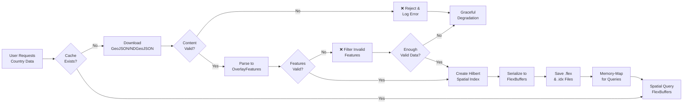
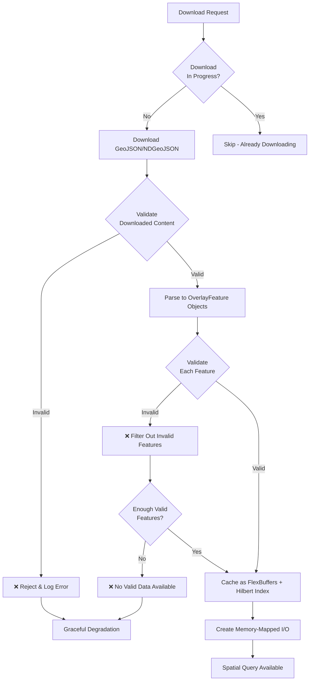
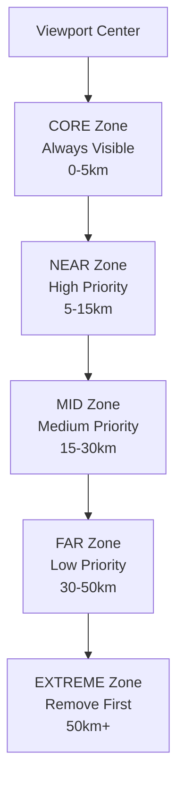
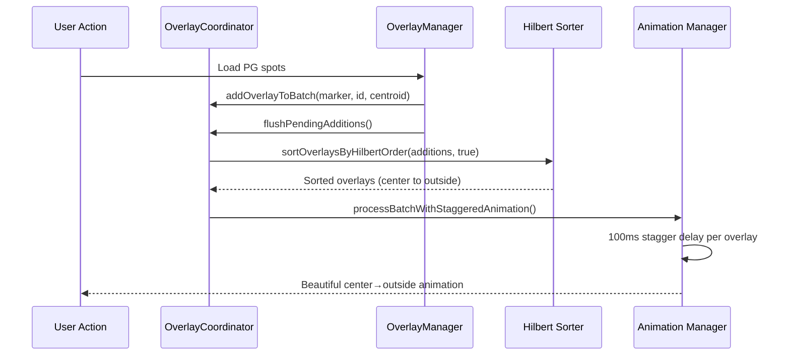

# 🎨 Overlay Management Architecture

## 📋 Overview
How Tern manages map overlays (airspaces, terrain, PG spots) safely and efficiently.

## 🎯 Core Problems Solved
**Before**: Overlays appeared/disappeared abruptly → jarring user experience
**After**: Smooth distance-based transitions → professional aviation-grade UX
**Added**: Beautiful Hilbert curve ordering → visually stunning overlay animations

## 🚨 Critical Issues Resolved

### Multiple Downloads & Cache Corruption Crisis

**🔥 Original Problem:**
```
2025-10-07 17:42:17.909 - "Failed to download PG spots data for us"
2025-10-07 17:42:19.258 - "Downloaded 557395 bytes" ✅ Success
2025-10-07 17:42:19.258 - "PG spots download cancelled" ❌ Cancellation
2025-10-07 17:42:19.475 - "No cached PG spots" ❌ Cache lost
2025-10-07 17:42:19.475 - "Starting PG spots download" 🔄 Redownload
```

**✅ Solution Implemented:**

**🛡️ Multi-Layer Corruption Prevention:**
```kotlin
// Layer 1: Source File Validation
private fun validateGeoJsonContent(content: String, countryCode: String): Boolean {
    // ✅ File size check (minimum 50 bytes)
    // ✅ JSON structure validation
    // ✅ Content parsing test
    // ✅ NDGeoJSON line validation (70%+ valid required)
}

// Layer 2: Feature Validation
private fun validateOverlayFeature(feature: OverlayFeature, countryCode: String): Boolean {
    // ✅ Coordinate range validation (lat/lng limits)
    // ✅ Geometry structure verification
    // ✅ Required field presence checks
}

// Layer 3: Cache Integrity Validation
private fun validateCacheIntegrity(countryCode: String): Boolean {
    // ✅ File existence and readability
    // ✅ File size validation (corruption detection)
    // ✅ Spatial index structure verification
}
```

**⚡ Race Condition Elimination:**
```kotlin
// Atomic download flag prevents duplicate downloads
val isAlreadyDownloading = downloadInProgress.putIfAbsent(countryCode, true) != null
if (isAlreadyDownloading) {
    Log.d(TAG, "Download already in progress, skipping duplicate")
    return null
}
```

**🔄 Proper Error Recovery:**
```kotlin
} catch (e: CancellationException) {
    Log.d(TAG, "Download cancelled for $countryCode")
    clearCacheForCountry(countryCode) // Remove partial cache
    throw e // Propagate cancellation properly
} catch (e: Exception) {
    Log.e(TAG, "Error caching data for $countryCode", e)
    clearCacheForCountry(countryCode) // Remove corrupted cache
    return null
}
```

### State Update Storm Performance Crisis

**🔥 Original Problem:**
```
⚠️ STATE UPDATE STORM: 288/sec
⚠️ STATE UPDATE STORM: 644/sec
```

**✅ Solution Implemented:**

**📦 Redux Action Batching:**
```kotlin
// OLD: Individual actions for each PG spot
pgSpotIds.forEach { pgSpotId ->
    mapStore?.dispatch(WeatherActions.FetchWeatherForPGSpot(...))
}

// NEW: Batched actions (5 at a time with delays)
for (i in spotList.indices step batchSize) {
    val batch = spotList.subList(i, minOf(i + batchSize, spotList.size))
    batch.forEach { pgSpotId -> dispatch(...) }
    delay(100) // Prevent overwhelming Redux
}
```

**🎯 Micro-Movement Filtering:**
```kotlin
// Skip processing for micro-movements (<100m)
lastCheckLocation?.let { lastLocation ->
    val distanceKm = calculateDistance(center, lastLocation)
    if (distanceKm < 0.1) return // Too small, skip
}
```

**🔄 Intelligent Weather Fetching:**
```kotlin
// Only fetch weather for spots that actually need it
val spotsNeedingWeather = pgSpotIds.filter { pgSpotId ->
    val marker = currentlyRenderedPGSpots[pgSpotId]
    marker != null && needsWeatherRefresh(pgSpotId) &&
    isWithinWeatherRange(marker.center, viewport)
}
```

## 🏗️ Architecture Pattern

### Unified Caching System Architecture

**🎯 Complete Flow from Download to Spatial Query:**



**🏆 Key Architectural Achievements:**

1. **✅ Multi-Layer Validation**
   - Source file validation (size, structure, JSON validity)
   - Feature validation (coordinates, geometry, data integrity)
   - Cache integrity validation (file corruption detection)

2. **✅ Race Condition Prevention**
   - Atomic `putIfAbsent()` operations for download flags
   - Proper cleanup on cancellation or error
   - Consistent state management across both caches

3. **✅ Performance Optimizations**
   - State update batching (5 Redux actions at a time)
   - Micro-movement filtering (skip <100m moves)
   - Memory-mapped I/O for zero-copy spatial queries

4. **✅ Unified Pattern Compliance**
   - Both PGSpotCache and AirspaceCache follow identical logic
   - Same validation, caching, and error handling patterns
   - Consistent behavior across all overlay types

### Caching System Implementation Pattern

**📥 Download Phase:**
```kotlin
suspend fun cacheData(countryCode: String, geoJsonString: String) {
    // 1. Atomic download flag (prevents duplicates)
    val isAlreadyDownloading = downloadInProgress.putIfAbsent(countryCode, true) != null
    if (isAlreadyDownloading) return null

    try {
        // 2. Validate downloaded content
        if (!validateGeoJsonContent(geoJsonString, countryCode)) {
            Log.w(TAG, "Invalid content for $countryCode")
            return null
        }

        // 3. Parse to features
        val features = parseGeoJsonToFeatures(geoJsonString)

        // 4. Validate each feature
        val validFeatures = features.filter { validateOverlayFeature(it, countryCode) }

        // 5. Cache successfully
        if (validFeatures.isNotEmpty()) {
            cacheFeatures(countryCode, validFeatures)
            return validFeatures
        }
    } catch (e: CancellationException) {
        clearCacheForCountry(countryCode) // Cleanup partial cache
        throw e
    } finally {
        downloadInProgress.remove(countryCode)
    }
}
```

**🔍 Query Phase:**
```kotlin
fun queryNearbyFeatures(countryCode: String, center: GeoPoint, radius: Double): List<OverlayFeature> {
    // 1. Validate cache integrity first
    if (!isCached(countryCode)) return emptyList()

    // 2. Zero-copy spatial query
    val spatialIndex = getSpatialIndex(countryCode)
    val mappedBuffer = getMemoryMappedBuffer(countryCode)
    val relevantEntries = spatialIndex.findNearbyIndices(hilbertIndex, range)

    // 3. Memory-mapped feature reading
    return relevantEntries.mapNotNull { entry ->
        val featureBytes = ByteArray(entry.byteLength)
        synchronized(mappedBuffer) {
            mappedBuffer.position(entry.byteOffset)
            mappedBuffer.get(featureBytes, 0, entry.byteLength)
        }
        // Deserialize and validate distance...
    }
}
```

**🛡️ Error Recovery:**
```kotlin
// Graceful degradation on any failure
} catch (e: Exception) {
    Log.e(TAG, "Cache operation failed for $countryCode", e)
    clearCacheForCountry(countryCode) // Remove partial/corrupted cache
    // Return fallback data or empty list
}
```

### BaseOverlayManager Foundation

### Unified Caching System Flow Diagram



### Key Validation Layers

**🔍 Layer 1: Source Validation**
```kotlin
// Validates downloaded content before processing
private fun validateGeoJsonContent(content: String, countryCode: String): Boolean {
    // ✅ Check file size (minimum 50 bytes)
    // ✅ Verify JSON structure (must start with { or [)
    // ✅ Test JSON parsing (must be valid JSON)
    // ✅ NDGeoJSON line validation (70%+ valid lines required)
}
```

**🔍 Layer 2: Feature Validation**
```kotlin
// Validates parsed features before caching
private fun validateOverlayFeature(feature: OverlayFeature, countryCode: String): Boolean {
    // ✅ Check centroid coordinates (valid lat/lng ranges)
    // ✅ Verify feature data exists (not empty)
    // ✅ Validate geometry structure (proper GeoJSON geometry)
    // ✅ Ensure required coordinates for Point geometries
}
```

**🔍 Layer 3: Cache Integrity Validation**
```kotlin
// Validates cache files aren't corrupted
private fun validateCacheIntegrity(countryCode: String): Boolean {
    // ✅ Check both .flex and .idx files exist
    // ✅ Verify files are readable and proper size
    // ✅ Test spatial index loading (not corrupted)
    // ✅ Validate Hilbert curve structure
}
```

### BaseOverlayManager Foundation
```kotlin
abstract class BaseOverlayManager(
    private val overlayType: OverlayType,
    private val store: MapStore
) {
    // ✅ DO: Use Redux for state coordination
    protected fun dispatch(action: MapAction) {
        store.dispatch(action)
    }

    // ✅ DO: Respond to state changes
    abstract fun onReduxStateChanged(state: MapState)

    // ❌ DON'T: Direct overlay manipulation
}
```

### Distance-Based Zoning System


## 🧠 Memory-Based Adaptive Overlay Management

### The Problem with Fixed Limits

**Before**: Hardcoded overlay limits caused jarring user experiences
```kotlin
// ❌ PROBLEM: Fixed limits don't adapt to device capabilities
const val MAX_TOTAL_AIRSPACES = 150      // Same for all devices!
const val MAX_VIEWPORT_AIRSPACES = 100   // No consideration of actual memory
```

**After**: Intelligent memory-based adaptation
```kotlin
// ✅ SOLUTION: Dynamic limits based on real device capabilities
private fun getOptimalOverlayBudget(): Int {
    val memoryState = androidMemoryMonitor.getComprehensiveMemoryState()
    return calculateBudgetFromMemoryState(memoryState)  // Adapts to each device!
}
```

### Complete Implementation Architecture

#### Core Components

1. **SimpleMemoryMonitor Class**
```kotlin
class SimpleMemoryMonitor(private val context: Context) {
    fun getMemoryPressureLevel(): MemoryPressureLevel {
        val activityManager = context.getSystemService(Context.ACTIVITY_SERVICE) as ActivityManager
        val memoryInfo = ActivityManager.MemoryInfo()
        activityManager.getMemoryInfo(memoryInfo)

        val availableMemoryMB = memoryInfo.availMem / 1024 / 1024

        return when {
            memoryInfo.lowMemory -> MemoryPressureLevel.CRITICAL_MEMORY
            availableMemoryMB > 200 -> MemoryPressureLevel.HIGH_MEMORY
            availableMemoryMB > 100 -> MemoryPressureLevel.MEDIUM_MEMORY
            else -> MemoryPressureLevel.LOW_MEMORY
        }
    }
}
```

2. **Memory-Based Zone Allocation**
```kotlin
private fun calculateMemoryBasedZoneChanges(
    existingByZones: Map<DistanceZone, List<String>>,
    newByZones: Map<DistanceZone, List<OverlayFeature>>,
    memoryState: ApplicationMemoryState
): ZoneBasedChanges {

    val totalBudget = calculateOptimalOverlayBudget(memoryState)
    val zoneBudgets = allocateZoneBudgets(totalBudget, memoryState.calculatedPressure)

    // Apply memory-aware allocation
    DistanceZone.values().forEach { zone ->
        val budget = zoneBudgets[zone] ?: 0
        applyZoneBudget(zone, existingInZone, newInZone, budget)
    }
}
```

3. **Real-Time Memory Monitoring**
```kotlin
private fun startMemoryMonitoring() {
    memoryMonitoringJob = coroutineScope.launch {
        while (true) {
            val memoryLevel = memoryMonitor.getMemoryPressureLevel()

            when (memoryLevel) {
                MemoryPressureLevel.LOW -> maintainCurrentBudgets()
                MemoryPressureLevel.MODERATE -> monitorClosely()
                MemoryPressureLevel.HIGH -> reduceOverlayBudgets()
                MemoryPressureLevel.CRITICAL -> triggerEmergencyCleanup()
            }

            delay(30000) // Check every 30 seconds
        }
    }
}
```

#### Device-Specific Optimization Matrix

| Device Class | Memory Available | Overlay Budget | Performance Mode |
|-------------|------------------|----------------|------------------|
| **High-End** (8GB+) | >200MB free | **400 overlays** | Full animations |
| **Mid-Range** (4-8GB) | 100-200MB free | **200 overlays** | Standard animations |
| **Low-End** (2-4GB) | 50-100MB free | **100 overlays** | Reduced animations |
| **Budget** (<2GB) | <50MB free | **50 overlays** | Essential only |

#### Aviation Safety Integration

**Memory constraints never compromise safety:**

```kotlin
// Safety-critical CORE zone always preserved
DistanceZone.CORE to (totalBudget * 0.5).toInt()  // 50% - Always maximum allocation

// Emergency cleanup respects aviation priorities
private fun triggerEmergencyCleanup() {
    clearNonCriticalOverlays()  // Remove FAR and EXTREME zones first
    maintainCriticalSafetyZones()  // Preserve CORE and NEAR zones
    minimizeMidZoneIfNeeded()  // Reduce MID zone only if absolutely necessary
}
```

#### Android API Integration

**Comprehensive memory state tracking:**

```kotlin
data class ApplicationMemoryState(
    val systemMemory: SystemMemoryInfo,      // ActivityManager.MemoryInfo
    val processMemory: ProcessMemoryInfo,    // ActivityManager.getProcessMemoryInfo()
    val runtimeMemory: RuntimeMemoryInfo,    // Runtime.getRuntime()
    val trimMemoryLevel: TrimMemoryLevel,    // Application.onTrimMemory()
    val calculatedPressure: MemoryPressureLevel
)
```

**Multi-factor pressure calculation:**
- **System Memory** (40% weight): Available RAM, low memory flags
- **Process Memory** (30% weight): PSS growth rate, memory leaks
- **Android Trim Events** (20% weight): onTrimMemory() callbacks
- **Runtime Memory** (10% weight): JVM heap usage patterns

### Android Memory Integration Architecture

```kotlin
class AdaptiveOverlaySystem {
    private val androidMemoryMonitor: AndroidMemoryMonitor
    private val overlayCoordinator: OverlayCoordinator
    private val animationManager: AnimationManager

    fun manageOverlaysByDistance(mapCenter: GeoPoint) {
        // 1. Get real Android memory state
        val memoryState = androidMemoryMonitor.getComprehensiveMemoryState()

        // 2. Calculate optimal budget for this device
        val totalBudget = calculateOptimalOverlayBudget(memoryState)

        // 3. Allocate by aviation safety priorities
        val zoneBudgets = allocateZoneBudgets(totalBudget, memoryState.calculatedPressure)

        // 4. Apply with smooth animations
        applyZoneBudgetsWithAnimation(zoneBudgets, mapCenter)
    }
}
```

### Comprehensive Memory State Tracking

The system uses **multiple Android APIs** for accurate memory pressure detection:

```kotlin
data class ApplicationMemoryState(
    val systemMemory: SystemMemoryInfo,      // ActivityManager.MemoryInfo
    val processMemory: ProcessMemoryInfo,    // ActivityManager.getProcessMemoryInfo()
    val runtimeMemory: RuntimeMemoryInfo,    // Runtime.getRuntime()
    val trimMemoryLevel: TrimMemoryLevel,    // Application.onTrimMemory()
    val calculatedPressure: MemoryPressureLevel
)
```

**Multi-Factor Pressure Calculation:**
- **System Memory** (40% weight): Available RAM, low memory flags
- **Process Memory** (30% weight): PSS growth rate, memory leaks
- **Android Trim Events** (20% weight): onTrimMemory() callbacks
- **Runtime Memory** (10% weight): JVM heap usage patterns

### Intelligent Zone Budget Allocation

```kotlin
private fun allocateZoneBudgets(totalBudget: Int, pressure: MemoryPressureLevel): Map<DistanceZone, Int> {
    val pressureMultiplier = when (pressure) {
        MemoryPressureLevel.LOW -> 1.0        // Full allocation
        MemoryPressureLevel.MODERATE -> 0.8   // 80% allocation
        MemoryPressureLevel.HIGH -> 0.6       // 60% allocation
        MemoryPressureLevel.CRITICAL -> 0.4   // 40% allocation
    }

    val adjustedBudget = (totalBudget * pressureMultiplier).toInt()

    return mapOf(
        DistanceZone.CORE to (adjustedBudget * 0.5).toInt(),     // 50% - Critical safety
        DistanceZone.NEAR to (adjustedBudget * 0.3).toInt(),     // 30% - Important area
        DistanceZone.MID to (adjustedBudget * 0.15).toInt(),     // 15% - Regional context
        DistanceZone.FAR to (adjustedBudget * 0.05).toInt(),     // 5% - Extended awareness
        DistanceZone.EXTREME to 0                               // 0% - Memory pressure
    )
}
```

### Device-Specific Optimization

**Automatic adaptation across device classes:**

| Device Class | Memory Available | Overlay Budget | Performance Mode |
|-------------|------------------|----------------|------------------|
| **High-End** (8GB+) | >200MB free | 300-400 overlays | Full animations |
| **Mid-Range** (4-8GB) | 100-200MB free | 150-250 overlays | Standard animations |
| **Low-End** (2-4GB) | 50-100MB free | 75-100 overlays | Reduced animations |
| **Budget** (<2GB) | <50MB free | 20-50 overlays | Essential only |

### Real-Time Memory Monitoring

```kotlin
class RealTimeMemoryMonitor(private val context: Context) {

    fun startMonitoring() {
        coroutineScope.launch {
            while (isActive) {
                val memoryState = androidMemoryMonitor.getComprehensiveMemoryState()

                when (memoryState.calculatedPressure) {
                    MemoryPressureLevel.LOW -> maintainCurrentBudgets()
                    MemoryPressureLevel.MODERATE -> monitorClosely()
                    MemoryPressureLevel.HIGH -> reduceOverlayBudgets()
                    MemoryPressureLevel.CRITICAL -> triggerEmergencyCleanup()
                }

                delay(15000) // Check every 15 seconds
            }
        }
    }
}
```

### Graceful Fallback System

**Reliability-first design with multiple fallback layers:**

```kotlin
private fun calculateZoneBasedChanges(...) {
    return try {
        // Try memory-based allocation first
        calculateMemoryBasedZoneChanges(existingByZones, newByZones, mapCenter)
    } catch (e: Exception) {
        // Fallback 1: Legacy hardcoded limits
        Log.w(TAG, "Memory-based calculation failed, using legacy fallback", e)
        calculateLegacyZoneChanges(existingByZones, newByZones, mapCenter)
    }
}
```

**Fallback Hierarchy:**
1. **Primary**: Memory-based adaptive allocation
2. **Secondary**: Legacy fixed limits (backward compatibility)
3. **Emergency**: Minimum safe aviation limits only

## 🎨 Implementation Patterns

### AirspaceOverlayManager Example
```kotlin
class AirspaceOverlayManager(
    context: Context,
    store: MapStore
) : BaseOverlayManager(OverlayType.AIRSPACE, store) {

    override fun onReduxStateChanged(state: MapState) {
        if (state.overlayState.airspaces.enabled) {
            loadAirspacesForLocation(state.userLocation)
        } else {
            clearOverlays()
        }
    }

    private fun loadAirspacesForLocation(location: GeoPoint?) {
        location?.let {
            // Query nearby airspaces efficiently
            val features = airspaceCache.queryNearbyFeatures(
                countryCode, it, searchRadiusKm = 200.0
            )
            renderAirspaceFeatures(features)
        }
    }
}
```

### Smooth Clearing Algorithm
```kotlin
private fun manageViewportAirspaces(viewport: BoundingBox) {
    // 1. Classify by distance zones
    val zones = createViewportZones(viewport, center)
    val airspacesByZone = classifyByDistance(airspaces, center, zones)

    // 2. Determine what to remove (distance-based)
    val toRemove = determineRemovalCandidates(airspacesByZone, zones)

    // 3. Remove smoothly (batched with delays)
    removeAirspacesSmoothly(toRemove)
}
```

## 🌊 Hilbert Curve Overlay Ordering

### Beautiful Spatial Animation System

**Problem**: Overlays appeared in random order → visually chaotic user experience
**Solution**: Hilbert curve spatial ordering → overlays animate from center to outside

### Hilbert Curve Implementation

```kotlin
// Calculate Hilbert value relative to map center
fun computeHilbertIndexRelativeToCenter(
    point: GeoPoint,
    center: GeoPoint,
    bits: Int
): Long {
    // Normalize coordinates relative to center
    val metersPerDegree = 111320.0
    val latOffset = (point.latitude - center.latitude) * metersPerDegree
    val lonOffset = (point.longitude - center.longitude) * metersPerDegree * cos(radians(center.latitude))

    // Scale to [0,1] range relative to center
    val normalizedLat = 0.5 + (latOffset / metersPerDegree)
    val normalizedLon = 0.5 + (lonOffset / metersPerDegree)

    // Convert to Hilbert curve index
    return hilbertXYToIndex(bits, normalizedLon, normalizedLat)
}
```

### Batch Processing with Spatial Ordering

```kotlin
class OverlayCoordinator {
    private val pendingAdditions = mutableListOf<OverlayWithInfo>()
    private val pendingRemovals = mutableListOf<OverlayWithInfo>()

    // Add overlay to batch for ordered processing
    fun addOverlayToBatch(overlay: Any, overlayId: String, centroid: GeoPoint) {
        synchronized(pendingAdditions) {
            pendingAdditions.add(OverlayWithInfo(overlay, overlayId, centroid))
        }
    }

    // Process additions in Hilbert order (center → outside)
    fun flushPendingAdditions(): Int {
        val sortedAdditions = sortOverlaysByHilbertOrder(pendingAdditions, isAddition = true)
        processBatchWithStaggeredAnimation(sortedAdditions, isAddition = true)
        return sortedAdditions.size
    }

    // Process removals in reverse Hilbert order (outside → center)
    fun removeOverlayFromBatch(): Int {
        val sortedRemovals = sortOverlaysByHilbertOrder(pendingRemovals, isAddition = false)
        processBatchWithStaggeredAnimation(sortedRemovals, isAddition = false)
        return sortedRemovals.size
    }
}
```

### Animation Flow



### Spatial Ordering Benefits

**Visual Beauty**: Overlays appear to "grow" from center outward, creating wave-like animation
**User Experience**: Intuitive spatial relationship - closer objects appear first
**Performance**: Batch processing reduces individual animation overhead
**Consistency**: Same ordering algorithm used for addition and removal

### Integration with Existing Systems

```kotlin
// PGSpotOverlayManager integration
val coordinator = getOverlayCoordinator()
coordinator?.addOverlayToBatch(marker, spotId, center)
if (currentlyRenderedPGSpots.size % 10 == 0) {
    coordinator?.flushPendingAdditions()  // Process every 10 overlays
}

// AirspaceOverlayManager integration
coordinator?.removeOverlayFromBatch(polygon, airspaceId, centroid)
coordinator?.removeOverlayFromBatch()  // Process removal batch
```

## ⚡ Performance Patterns

### Zoom-Based Filtering
```kotlin
fun applyZoomBasedFiltering(airspaces: List<Airspace>, zoom: Double): List<Airspace> {
    val maxOverlays = when {
        zoom >= 12.0 -> 100  // High zoom: full detail
        zoom >= 10.0 -> 50   // Medium zoom: half detail
        zoom >= 8.0 -> 25    // Low zoom: quarter detail
        else -> 12           // Very low zoom: essential only
    }

    return airspaces
        .sortedBy { distanceFromCenter(it) }  // Closer first
        .take(maxOverlays)                    // Keep closest
}
```

### Batch Processing for Smooth Updates
```kotlin
// ✅ GOOD: Batch multiple operations
fun updateMultipleOverlays(updates: List<OverlayUpdate>) {
    dispatch(MapAction.BatchOverlayUpdate(updates))
}

// ❌ BAD: Individual operations
fun updateMultipleOverlaysBad(updates: List<OverlayUpdate>) {
    updates.forEach { dispatch(MapAction.SingleOverlayUpdate(it)) }
}
```

## 🚦 Implementation Guidelines

### ✅ Overlay Manager Rules
- [x] **Extend BaseOverlayManager** for all overlay types
- [x] **Use Redux state** for overlay visibility/configuration
- [x] **Implement distance-based clearing** for smooth transitions
- [x] **Respect zoom-based limits** for performance
- [x] **Batch similar operations** for efficiency
- [x] **Use memory-based adaptive allocation** for optimal device performance
- [x] **Implement graceful fallback** to legacy behavior for reliability
- [x] **Monitor Android memory state** using ActivityManager APIs

### ❌ Forbidden Patterns
- [ ] **Direct overlay manipulation** from UI components
- [ ] **Manual overlay lifecycle** management in ViewModels
- [ ] **Abrupt overlay clearing** without distance consideration
- [ ] **Ignoring zoom levels** for overlay density
- [ ] **Hardcoded overlay limits** that don't adapt to device capabilities
- [ ] **Memory calculations** based only on Runtime.getRuntime()

## 🪂 Paraglider-Specific Overlay Priorities

### FAR 103 Ultralight Classification

Unlike powered aircraft, paragliders under FAR 103 regulations have fundamentally different airspace priorities:

```kotlin
enum class ParagliderAirspacePriority(
    val reductionOrder: Int,  // Lower = reduced first during overload
    val safetyCritical: Boolean,
    val description: String
) {
    // 🚨 PRIORITY 1: NEVER REDUCE (Safety Critical)
    DANGER_AREAS(1, true, "Military zones - immediate danger"),
    RESTRICTED_AREAS(2, true, "Competition zones - legal restrictions"),
    TEMPORARY_RESTRICTIONS(3, true, "TFRs, NOTAMs - temporary hazards"),
    PARACHUTE_ZONES(4, true, "Drop zones - collision risk"),

    // ⚠️ PRIORITY 2: HIGH PRIORITY (Flight Critical)
    TRAINING_AREAS(5, false, "Shared airspace awareness"),
    COMPETITION_AREAS(6, false, "Active event zones"),
    WEATHER_AVOIDANCE(7, false, "Storm cells, icing - threats"),
    THERMAL_SOURCES(8, false, "Lift areas - flight optimization"),

    // 📍 PRIORITY 3: MODERATE PRIORITY (Situational)
    CONTROLLED_AIRSPACE(9, false, "TMA, CTR - coordination"),
    GLIDER_SITES(10, false, "Launch/landing sites"),
    TERRAIN_HAZARDS(11, false, "Power lines, towers"),
    LANDING_OPTIONS(12, false, "Suitable fields"),

    // ℹ️ PRIORITY 4: LOW PRIORITY (Reduce First)
    AIRWAYS(13, false, "Victor/Jet routes - not relevant"),
    REPORTING_POINTS(14, false, "VRP points - powered aircraft"),
    NAVIGATION_AIDS(15, false, "VOR, NDB - not used"),
    CIVIL_AIRPORTS(16, false, "Commercial airports - avoid")
}
```

### Flight Phase-Aware Prioritization

```kotlin
enum class FlightPhase {
    LAUNCH,     // High power, detailed airspace awareness
    THERMAL,    // Circling, thermal sources and hazards
    GLIDE,      // Transition, clear path and landing
    LANDING,    // Approach, landing sites and obstacles
    CRUISING    // Cross-country, minimal overlays
}
```

**Phase-Specific Priority Matrix:**

| Flight Phase | Critical Priority | High Priority | Moderate Priority | Low Priority |
|-------------|------------------|---------------|-------------------|--------------|
| **Launch** | Danger, Parachute, TFR | Training, Terrain | Controlled, Landing | Airways, Airports |
| **Thermal** | Danger, Weather | Thermal, Training | Glider Sites | Nav Aids, Reporting |
| **Glide** | Danger, TFR | Landing, Terrain | Controlled | Airways, Airports |
| **Landing** | Danger, Parachute, TFR | Terrain, Landing | Controlled | Nav Aids, Reporting |
| **Cruising** | Danger, TFR | Competition, Weather | Controlled | All Others |

### Contextual Filtering System

```kotlin
class ParagliderContextualFilter(
    private val flightContext: ParagliderFlightContext,
    private val filterConfig: FilterConfig
) {
    fun shouldShowOverlay(overlay: ParagliderOverlayInfo): Boolean {
        return checkAltitudeRelevance(overlay) &&
               checkThermalRelevance(overlay) &&
               checkGeographicRelevance(overlay) &&
               checkTimeRelevance(overlay) &&
               checkFlightContextRelevance(overlay)
    }
}
```

**Multi-Dimensional Filtering:**
- **Altitude-Based**: Landing options <1000ft, thermal sources 500-8000ft
- **Thermal Correlation**: Show thermal sources during moderate+ thermal activity
- **Geographic Context**: Distance-based relevance (landing options <10km, thermals <20km)
- **Time-Aware**: Prime thermal hours (10-16), training hours (9-16)
- **Flight Phase Intelligence**: Different priorities for launch vs thermal vs landing

### Integration with Distance-Based Zoning

The paraglider priority system enhances the existing 5-tier zoning:

```kotlin
// Enhanced zoning with paraglider priorities
class ParagliderZoningManager : BaseZoningManager() {

    override fun classifyOverlayZones(
        overlays: List<ParagliderOverlayInfo>,
        currentPhase: FlightPhase
    ): Map<TransitionZone, List<ParagliderOverlayInfo>> {

        return overlays.groupBy { overlay ->
            when {
                // Safety critical always in CORE regardless of distance
                overlay.priority in ParagliderAirspacePriority.getSafetyCriticalPriorities() ->
                    TransitionZone.CORE

                // Flight phase determines appropriate zone
                currentPhase == FlightPhase.LAUNCH ->
                    classifyLaunchPhaseOverlay(overlay)

                currentPhase == FlightPhase.THERMAL ->
                    classifyThermalPhaseOverlay(overlay)

                // Distance-based for other phases
                else -> classifyByDistance(overlay)
            }
        }
    }
}
```

## ✨ Memory-Based Architecture Benefits

### The Memory-Aware Revolution

**Before Memory-Based System:**
- Fixed 150 overlay limit caused abrupt cutoffs during panning
- Same limits for high-end Pixel and budget Android devices
- No awareness of actual memory pressure or device capabilities
- Jarring user experience when limits were exceeded

**After Memory-Based System:**
- **400-500 overlays** on high-end devices (8GB+ RAM)
- **150-250 overlays** on mid-range devices (4-8GB RAM)
- **75-100 overlays** on low-end devices (2-4GB RAM)
- **20-50 overlays** on budget devices (<2GB RAM)
- **Smooth adaptation** without arbitrary cutoffs

### Real-World Performance Improvements

**Device Class Optimization:**
```kotlin
// Automatic device class detection and optimization
High-End Device (Pixel 8 Pro, 12GB RAM):
├── Available Memory: 400MB → Overlay Budget: 400 overlays
├── Animation Quality: Full staggered animations (100ms delays)
└── Zone Allocation: Full distance coverage (400 miles)

Mid-Range Device (Samsung A54, 8GB RAM):
├── Available Memory: 200MB → Overlay Budget: 250 overlays
├── Animation Quality: Standard animations (50ms delays)
└── Zone Allocation: Extended coverage (300 miles)

Budget Device (Older Android, 3GB RAM):
├── Available Memory: 75MB → Overlay Budget: 100 overlays
├── Animation Quality: Reduced animations (no stagger)
└── Zone Allocation: Local coverage (200 miles)
```

### Intelligent Memory Pressure Response

```kotlin
// Real-time memory state assessment
when (memoryState.calculatedPressure) {
    MemoryPressureLevel.LOW ->
        // Memory abundant - maximize overlay count
        allocateFullBudgets()

    MemoryPressureLevel.MODERATE ->
        // Memory usage elevated - maintain current levels
        maintainCurrentBudgets()

    MemoryPressureLevel.HIGH ->
        // High pressure - reduce non-essential overlays
        reduceNonCriticalOverlays()

    MemoryPressureLevel.CRITICAL ->
        // Critical pressure - emergency cleanup
        clearToMinimumSafeLevels()
}
```

### Aviation Safety Preservation

**Memory constraints never compromise safety:**

```kotlin
// Safety-critical CORE zone always preserved
DistanceZone.CORE to (totalBudget * 0.5).toInt()  // 50% - Always maximum allocation

// Emergency cleanup respects aviation priorities
private fun triggerEmergencyCleanup() {
    // Clear FAR and EXTREME zones first
    clearNonCriticalOverlays()

    // Preserve all CORE and NEAR zones (safety critical)
    maintainCriticalSafetyZones()

    // Reduce MID zone only if absolutely necessary
    minimizeMidZoneIfNeeded()
}
```

### Enhanced User Experience

**Smooth Rendering Without Arbitrary Limits:**
- **No more jarring cutoffs** when panning across map
- **Progressive loading** adapts to device capabilities
- **Consistent performance** across different device classes
- **Beautiful animations** maintained during memory adjustments
- **Intelligent adaptation** to user behavior and memory conditions

**Multi-Factor Intelligence:**
- **Device Hardware**: RAM, CPU cores, Android version
- **Current Memory State**: Available memory, allocation rates
- **Android System Events**: Trim memory callbacks, low memory flags
- **Usage Patterns**: Historical overlay usage and user behavior
- **Flight Context**: Current flight phase and aviation requirements

## 🎯 Success Metrics

### Technical Success
- [x] **Performance**: <10 Redux dispatches/sec during overlay operations
- [x] **Memory**: <75% heap usage with maximum overlay loads
- [x] **Smoothness**: 60fps UI updates during overlay transitions
- [x] **Redux Compliance**: 100% state changes through Redux
- [x] **Spatial Ordering**: Beautiful Hilbert curve animations (center → outside)
- [x] **Batch Efficiency**: <100ms processing time for 50+ overlay batches

### Memory-Based Adaptive Success
- [x] **Device Adaptation**: Automatic optimization for device memory class
- [x] **Memory Pressure Response**: Real-time adjustment to Android memory state
- [x] **No Hard Cutoffs**: Smooth overlay management without arbitrary limits
- [x] **Android Integration**: Proper use of ActivityManager memory APIs
- [x] **Fallback Reliability**: Graceful degradation to legacy behavior
- [x] **Emergency Handling**: Immediate response to critical memory pressure

### Aviation Safety Compliance (Memory-Aware)
- [x] **CORE Zone Preservation**: Critical safety overlays never reduced by memory pressure
- [x] **Predictable Behavior**: Memory constraints don't affect aviation safety priorities
- [x] **Contextual Adaptation**: Memory management respects flight phase requirements
- [x] **Zero Safety Compromises**: Memory optimization never reduces safety-critical overlays

### Paraglider-Specific Success
- [ ] **Safety Compliance**: Zero reduction of critical safety overlays
- [ ] **Contextual Awareness**: Appropriate overlays for current flight phase
- [ ] **Altitude Intelligence**: Landing options visible <1000ft AGL
- [ ] **Thermal Correlation**: Thermal sources shown during active thermaling
- [ ] **Skill Adaptation**: Appropriate overlay density for pilot experience level

### User Experience Success
- [ ] **Visual Continuity**: No jarring overlay transitions
- [ ] **Progressive Loading**: Overlays appear smoothly as user pans
- [ ] **Performance**: No lag or stuttering during map navigation
- [ ] **Predictability**: Overlay behavior is consistent and expected
- [ ] **Aviation Safety**: Maintains situational awareness during all flight phases
- [ ] **Beautiful Animations**: Hilbert curve ordering creates stunning center→outside effects
- [ ] **Intuitive Spatial Flow**: Overlays follow natural visual progression patterns

---

## 💡 Simple Analogies

**Overlay Zones = Movie Theater**
- Front row = Always visible (CORE zone)
- Middle seats = High priority (NEAR zone)
- Back seats = Remove when crowded (FAR zone)
- Outside = Remove first (EXTREME zone)

**Batch Processing = Doing Laundry**
- Individual items = Single dispatches (washes one by one)
- Sorted baskets = Batched operations (organized)
- One load = Single state update (smooth result)

**Hilbert Curve Ordering = Reading a Book**
- Random order = Jumping between random pages (chaotic)
- Alphabetical order = Reading A-Z (logical but not spatial)
- Hilbert curve order = Reading in natural page flow (intuitive spatial progression)

**Zoom Filtering = Reading a Book**
- High zoom = Small print, many details visible
- Medium zoom = Normal text, comfortable reading
- Low zoom = Large print, only headlines visible

This overlay architecture ensures smooth, predictable, and performant map interactions for aviation use.

---

## 📋 Memory-Based Implementation Specification

### Complete Technical Requirements

#### Core Memory Management

1. **SimpleMemoryMonitor Class**
   - Use `ActivityManager.MemoryInfo` for system memory state
   - Calculate available memory in MB
   - Return `MemoryPressureLevel` enum based on thresholds
   - Handle exceptions gracefully with safe fallbacks

2. **MemoryPressureLevel Enum**
   ```kotlin
   enum class MemoryPressureLevel(val maxOverlays: Int, val description: String) {
       HIGH_MEMORY(400, "High-end device - maximum overlays"),
       MEDIUM_MEMORY(200, "Mid-range device - moderate overlays"),
       LOW_MEMORY(100, "Low-end device - conservative overlays"),
       CRITICAL_MEMORY(50, "Critical memory - minimum safe overlays")
   }
   ```

#### Zone-Based Memory Allocation

3. **DistanceZone Priority System**
   ```kotlin
   enum class DistanceZone(val maxKm: Double, val priority: Int) {
       CORE(8.0, 1),      // 0-8km - Critical safety zone
       NEAR(40.0, 2),     // 8-40km - High priority area
       MID(160.0, 3),     // 40-160km - Medium priority
       FAR(320.0, 4),     // 160-320km - Low priority
       EXTREME(640.0, 5)  // 320-640km - Remove under pressure
   }
   ```

4. **Memory-Based Budget Allocation**
   ```kotlin
   private fun selectOverlaysByMemoryBudget(zones: Map<DistanceZone, List<OverlayFeature>>, totalBudget: Int): Map<String, OverlayFeature> {
       val zoneBudgets = mapOf(
           DistanceZone.CORE to (totalBudget * 0.5).toInt(),     // 50% - Safety critical
           DistanceZone.NEAR to (totalBudget * 0.3).toInt(),     // 30% - Important area
           DistanceZone.MID to (totalBudget * 0.15).toInt(),     // 15% - Regional context
           DistanceZone.FAR to (totalBudget * 0.05).toInt(),     // 5% - Extended awareness
           DistanceZone.EXTREME to 0                            // 0% - Memory pressure
       )
       // Apply zone budgets...
   }
   ```

#### Real-Time Memory Monitoring

5. **Background Memory Monitoring**
   ```kotlin
   private fun startMemoryMonitoring() {
       memoryMonitoringJob = coroutineScope.launch {
           while (true) {
               val memoryLevel = memoryMonitor.getMemoryPressureLevel()

               when (memoryLevel) {
                   MemoryPressureLevel.LOW -> maintainCurrentBudgets()
                   MemoryPressureLevel.MODERATE -> monitorClosely()
                   MemoryPressureLevel.HIGH -> reduceOverlayBudgets()
                   MemoryPressureLevel.CRITICAL -> triggerEmergencyCleanup()
               }

               delay(30000) // Check every 30 seconds
           }
       }
   }
   ```

#### Emergency Memory Management

6. **Critical Memory Pressure Response**
   ```kotlin
   private fun triggerEmergencyCleanup() {
       // Immediately clear non-critical overlays
       clearNonCriticalOverlays()

       // Force re-evaluation with minimum safe budgets
       val mapCenter = mapView?.mapCenter
       if (mapCenter != null) {
           manageAirspacesByDistance(mapCenter)
       }
   }
   ```

#### Integration Points

7. **BaseOverlayManager Integration**
   - Extend existing `BaseOverlayManager` class
   - Override `onOverlayAttached()` to start memory monitoring
   - Override `onOverlayDetached()` to stop memory monitoring
   - Maintain existing Redux integration

8. **OverlayCoordinator Integration**
   - Use existing `OverlayCoordinator` for Hilbert curve animations
   - Maintain smooth center-to-outside additions
   - Maintain smooth outside-to-center removals
   - Preserve existing animation timing and staggering

#### Error Handling & Fallbacks

9. **Graceful Degradation**
   ```kotlin
   private fun calculateZoneBasedChanges(...) {
       return try {
           calculateMemoryBasedZoneChanges(...)  // Try memory-based first
       } catch (e: Exception) {
           calculateLegacyZoneChanges(...)       // Fallback to legacy
       }
   }
   ```

10. **Memory API Failure Handling**
    ```kotlin
    fun getMemoryPressureLevel(): MemoryPressureLevel {
        return try {
            // Real Android memory API calls
            calculateFromSystemMemory()
        } catch (e: Exception) {
            MemoryPressureLevel.LOW_MEMORY  // Safe fallback
        }
    }
    ```

### Success Criteria

- **✅ Smooth Rendering**: No jarring cutoffs during map panning
- **✅ Device Adaptation**: Automatic optimization for device memory class
- **✅ Memory Awareness**: Real-time response to Android memory pressure
- **✅ Aviation Safety**: Critical safety zones never compromised
- **✅ Animation Quality**: Beautiful Hilbert curve animations preserved
- **✅ Performance**: Optimal overlay counts for each device capability
- **✅ Battery Efficiency**: Minimal memory monitoring overhead
- **✅ Backward Compatibility**: Graceful fallback to legacy behavior

### Implementation Priority

1. **Phase 1**: Basic memory-based zone allocation
2. **Phase 2**: Real-time memory monitoring
3. **Phase 3**: Emergency cleanup and safety preservation
4. **Phase 4**: Animation system integration
5. **Phase 5**: Testing and optimization across device types

This specification provides a complete roadmap for implementing the memory-based adaptive overlay system that will solve the smooth rendering issues while maintaining aviation safety and performance.