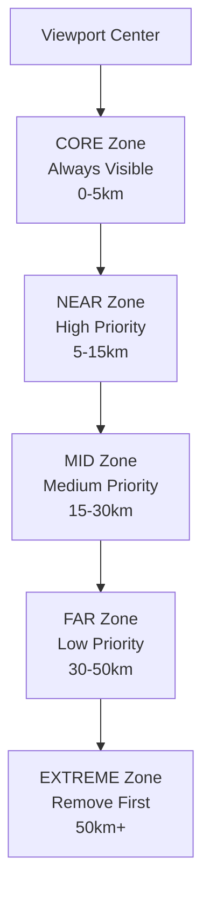

# 🎨 Overlay Management Architecture

## 📋 Overview
How Tern manages map overlays (airspaces, terrain, PG spots) safely and efficiently.

## 🎯 Core Problem Solved
**Before**: Overlays appeared/disappeared abruptly → jarring user experience
**After**: Smooth distance-based transitions → professional aviation-grade UX

## 🏗️ Architecture Pattern

### BaseOverlayManager Foundation
```kotlin
abstract class BaseOverlayManager(
    private val overlayType: OverlayType,
    private val store: MapStore
) {
    // ✅ DO: Use Redux for state coordination
    protected fun dispatch(action: MapAction) {
        store.dispatch(action)
    }

    // ✅ DO: Respond to state changes
    abstract fun onReduxStateChanged(state: MapState)

    // ❌ DON'T: Direct overlay manipulation
}
```

### Distance-Based Zoning System


## 🎨 Implementation Patterns

### AirspaceOverlayManager Example
```kotlin
class AirspaceOverlayManager(
    context: Context,
    store: MapStore
) : BaseOverlayManager(OverlayType.AIRSPACE, store) {

    override fun onReduxStateChanged(state: MapState) {
        if (state.overlayState.airspaces.enabled) {
            loadAirspacesForLocation(state.userLocation)
        } else {
            clearOverlays()
        }
    }

    private fun loadAirspacesForLocation(location: GeoPoint?) {
        location?.let {
            // Query nearby airspaces efficiently
            val features = airspaceCache.queryNearbyFeatures(
                countryCode, it, searchRadiusKm = 200.0
            )
            renderAirspaceFeatures(features)
        }
    }
}
```

### Smooth Clearing Algorithm
```kotlin
private fun manageViewportAirspaces(viewport: BoundingBox) {
    // 1. Classify by distance zones
    val zones = createViewportZones(viewport, center)
    val airspacesByZone = classifyByDistance(airspaces, center, zones)

    // 2. Determine what to remove (distance-based)
    val toRemove = determineRemovalCandidates(airspacesByZone, zones)

    // 3. Remove smoothly (batched with delays)
    removeAirspacesSmoothly(toRemove)
}
```

## ⚡ Performance Patterns

### Zoom-Based Filtering
```kotlin
fun applyZoomBasedFiltering(airspaces: List<Airspace>, zoom: Double): List<Airspace> {
    val maxOverlays = when {
        zoom >= 12.0 -> 100  // High zoom: full detail
        zoom >= 10.0 -> 50   // Medium zoom: half detail
        zoom >= 8.0 -> 25    // Low zoom: quarter detail
        else -> 12           // Very low zoom: essential only
    }

    return airspaces
        .sortedBy { distanceFromCenter(it) }  // Closer first
        .take(maxOverlays)                    // Keep closest
}
```

### Batch Processing for Smooth Updates
```kotlin
// ✅ GOOD: Batch multiple operations
fun updateMultipleOverlays(updates: List<OverlayUpdate>) {
    dispatch(MapAction.BatchOverlayUpdate(updates))
}

// ❌ BAD: Individual operations
fun updateMultipleOverlaysBad(updates: List<OverlayUpdate>) {
    updates.forEach { dispatch(MapAction.SingleOverlayUpdate(it)) }
}
```

## 🚦 Implementation Guidelines

### ✅ Overlay Manager Rules
- [ ] **Extend BaseOverlayManager** for all overlay types
- [ ] **Use Redux state** for overlay visibility/configuration
- [ ] **Implement distance-based clearing** for smooth transitions
- [ ] **Respect zoom-based limits** for performance
- [ ] **Batch similar operations** for efficiency

### ❌ Forbidden Patterns
- [ ] **Direct overlay manipulation** from UI components
- [ ] **Manual overlay lifecycle** management in ViewModels
- [ ] **Abrupt overlay clearing** without distance consideration
- [ ] **Ignoring zoom levels** for overlay density

## 🪂 Paraglider-Specific Overlay Priorities

### FAR 103 Ultralight Classification

Unlike powered aircraft, paragliders under FAR 103 regulations have fundamentally different airspace priorities:

```kotlin
enum class ParagliderAirspacePriority(
    val reductionOrder: Int,  // Lower = reduced first during overload
    val safetyCritical: Boolean,
    val description: String
) {
    // 🚨 PRIORITY 1: NEVER REDUCE (Safety Critical)
    DANGER_AREAS(1, true, "Military zones - immediate danger"),
    RESTRICTED_AREAS(2, true, "Competition zones - legal restrictions"),
    TEMPORARY_RESTRICTIONS(3, true, "TFRs, NOTAMs - temporary hazards"),
    PARACHUTE_ZONES(4, true, "Drop zones - collision risk"),

    // ⚠️ PRIORITY 2: HIGH PRIORITY (Flight Critical)
    TRAINING_AREAS(5, false, "Shared airspace awareness"),
    COMPETITION_AREAS(6, false, "Active event zones"),
    WEATHER_AVOIDANCE(7, false, "Storm cells, icing - threats"),
    THERMAL_SOURCES(8, false, "Lift areas - flight optimization"),

    // 📍 PRIORITY 3: MODERATE PRIORITY (Situational)
    CONTROLLED_AIRSPACE(9, false, "TMA, CTR - coordination"),
    GLIDER_SITES(10, false, "Launch/landing sites"),
    TERRAIN_HAZARDS(11, false, "Power lines, towers"),
    LANDING_OPTIONS(12, false, "Suitable fields"),

    // ℹ️ PRIORITY 4: LOW PRIORITY (Reduce First)
    AIRWAYS(13, false, "Victor/Jet routes - not relevant"),
    REPORTING_POINTS(14, false, "VRP points - powered aircraft"),
    NAVIGATION_AIDS(15, false, "VOR, NDB - not used"),
    CIVIL_AIRPORTS(16, false, "Commercial airports - avoid")
}
```

### Flight Phase-Aware Prioritization

```kotlin
enum class FlightPhase {
    LAUNCH,     // High power, detailed airspace awareness
    THERMAL,    // Circling, thermal sources and hazards
    GLIDE,      // Transition, clear path and landing
    LANDING,    // Approach, landing sites and obstacles
    CRUISING    // Cross-country, minimal overlays
}
```

**Phase-Specific Priority Matrix:**

| Flight Phase | Critical Priority | High Priority | Moderate Priority | Low Priority |
|-------------|------------------|---------------|-------------------|--------------|
| **Launch** | Danger, Parachute, TFR | Training, Terrain | Controlled, Landing | Airways, Airports |
| **Thermal** | Danger, Weather | Thermal, Training | Glider Sites | Nav Aids, Reporting |
| **Glide** | Danger, TFR | Landing, Terrain | Controlled | Airways, Airports |
| **Landing** | Danger, Parachute, TFR | Terrain, Landing | Controlled | Nav Aids, Reporting |
| **Cruising** | Danger, TFR | Competition, Weather | Controlled | All Others |

### Contextual Filtering System

```kotlin
class ParagliderContextualFilter(
    private val flightContext: ParagliderFlightContext,
    private val filterConfig: FilterConfig
) {
    fun shouldShowOverlay(overlay: ParagliderOverlayInfo): Boolean {
        return checkAltitudeRelevance(overlay) &&
               checkThermalRelevance(overlay) &&
               checkGeographicRelevance(overlay) &&
               checkTimeRelevance(overlay) &&
               checkFlightContextRelevance(overlay)
    }
}
```

**Multi-Dimensional Filtering:**
- **Altitude-Based**: Landing options <1000ft, thermal sources 500-8000ft
- **Thermal Correlation**: Show thermal sources during moderate+ thermal activity
- **Geographic Context**: Distance-based relevance (landing options <10km, thermals <20km)
- **Time-Aware**: Prime thermal hours (10-16), training hours (9-16)
- **Flight Phase Intelligence**: Different priorities for launch vs thermal vs landing

### Integration with Distance-Based Zoning

The paraglider priority system enhances the existing 5-tier zoning:

```kotlin
// Enhanced zoning with paraglider priorities
class ParagliderZoningManager : BaseZoningManager() {

    override fun classifyOverlayZones(
        overlays: List<ParagliderOverlayInfo>,
        currentPhase: FlightPhase
    ): Map<TransitionZone, List<ParagliderOverlayInfo>> {

        return overlays.groupBy { overlay ->
            when {
                // Safety critical always in CORE regardless of distance
                overlay.priority in ParagliderAirspacePriority.getSafetyCriticalPriorities() ->
                    TransitionZone.CORE

                // Flight phase determines appropriate zone
                currentPhase == FlightPhase.LAUNCH ->
                    classifyLaunchPhaseOverlay(overlay)

                currentPhase == FlightPhase.THERMAL ->
                    classifyThermalPhaseOverlay(overlay)

                // Distance-based for other phases
                else -> classifyByDistance(overlay)
            }
        }
    }
}
```

## 🎯 Success Metrics

### Technical Success
- [ ] **Performance**: <10 Redux dispatches/sec during overlay operations
- [ ] **Memory**: <75% heap usage with maximum overlay loads
- [ ] **Smoothness**: 60fps UI updates during overlay transitions
- [ ] **Redux Compliance**: 100% state changes through Redux

### Paraglider-Specific Success
- [ ] **Safety Compliance**: Zero reduction of critical safety overlays
- [ ] **Contextual Awareness**: Appropriate overlays for current flight phase
- [ ] **Altitude Intelligence**: Landing options visible <1000ft AGL
- [ ] **Thermal Correlation**: Thermal sources shown during active thermaling
- [ ] **Skill Adaptation**: Appropriate overlay density for pilot experience level

### User Experience Success
- [ ] **Visual Continuity**: No jarring overlay transitions
- [ ] **Progressive Loading**: Overlays appear smoothly as user pans
- [ ] **Performance**: No lag or stuttering during map navigation
- [ ] **Predictability**: Overlay behavior is consistent and expected
- [ ] **Aviation Safety**: Maintains situational awareness during all flight phases

---

## 💡 Simple Analogies

**Overlay Zones = Movie Theater**
- Front row = Always visible (CORE zone)
- Middle seats = High priority (NEAR zone)
- Back seats = Remove when crowded (FAR zone)
- Outside = Remove first (EXTREME zone)

**Batch Processing = Doing Laundry**
- Individual items = Single dispatches (washes one by one)
- Sorted baskets = Batched operations (organized)
- One load = Single state update (smooth result)

**Zoom Filtering = Reading a Book**
- High zoom = Small print, many details visible
- Medium zoom = Normal text, comfortable reading
- Low zoom = Large print, only headlines visible

This overlay architecture ensures smooth, predictable, and performant map interactions for aviation use.