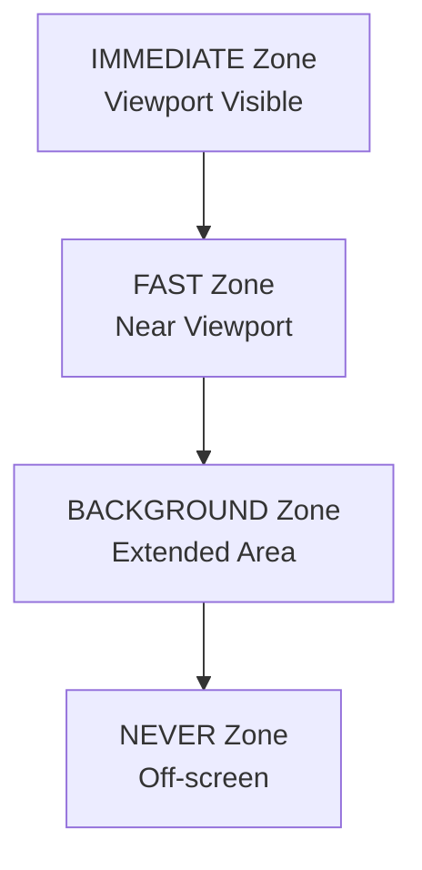

# ⚡ Performance Optimization Guidelines

## 📋 Overview
How to keep Tern fast and responsive for aviation use.

## 🎯 Performance Targets

### Core Metrics
```
🚀 Speed: <10 Redux dispatches per second
💾 Memory: <75% of available heap
🎯 Smooth: 60fps UI updates
🔄 Efficient: Smart caching and batching
```

### Why These Numbers Matter
- **<10 dispatches/sec**: Prevents Redux update storms that cause ANR crashes
- **<75% memory**: Leaves headroom for map tiles, overlays, and system operations
- **60fps**: Ensures smooth visual experience during flight
- **Smart caching**: Reduces network requests for offline aviation use

## 🏗️ Performance Patterns

### Redux Batching
```kotlin
// ✅ GOOD: Batch multiple actions
class MapStore : ViewModel() {
    private val actionQueue = ConcurrentLinkedQueue<Any>()
    private val batchWindow = 100L // Process every 100ms

    fun dispatch(action: MapAction) {
        actionQueue.offer(action)
        if (!isProcessing) {
            processBatchAsync()
        }
    }

    private suspend fun processBatch() {
        val actions = actionQueue.drainToList()
        val newState = actions.fold(initialState) { state, action ->
            reducer(state, action)
        }
        _state.value = newState // Single update
    }
}
```

### Spatial Query Optimization
```kotlin
// ✅ GOOD: Query by distance, not entire countries
fun loadNearbyAirspaces(center: GeoPoint, radiusKm: Double) {
    val features = airspaceCache.queryNearbyFeatures(
        countryCode, center, radiusKm
    ) // Only nearby, not entire country
}

// ❌ BAD: Load entire countries
fun loadAllCountryAirspaces(countryCode: String) {
    val features = airspaceCache.getAllFeatures(countryCode) // Too much data!
}
```

## 🎨 Overlay Performance

### Distance-Based Loading Zones


### Zoom-Based Overlay Limits
```kotlin
data class ZoomPerformanceConfig(
    val maxOverlays: Int,
    val updateFrequency: Long,
    val cacheStrategy: CacheStrategy
)

fun getPerformanceConfig(zoom: Double): ZoomPerformanceConfig {
    return when {
        zoom >= 12.0 -> ZoomPerformanceConfig(100, 50L, CacheStrategy.AGGRESSIVE)
        zoom >= 10.0 -> ZoomPerformanceConfig(50, 100L, CacheStrategy.MODERATE)
        zoom >= 8.0 -> ZoomPerformanceConfig(25, 200L, CacheStrategy.CONSERVATIVE)
        else -> ZoomPerformanceConfig(12, 500L, CacheStrategy.MINIMAL)
    }
}
```

## 🚀 Memory Management

### Smart Caching Strategy
```kotlin
// ✅ GOOD: Intelligent country caching
class UniversalCountryCacheManager {
    private val maxCountries = 4 // Aviation limit

    fun getRelevantCountries(viewport: BoundingBox): List<String> {
        return countriesInViewport(viewport).take(maxCountries)
    }
}

// ❌ BAD: Unlimited caching
class BadCacheManager {
    fun cacheAllCountries() { // Memory explosion!
        // Caches entire world
    }
}
```

## ⚡ Optimization Techniques

### Debounced Updates
```kotlin
// ✅ GOOD: Debounce rapid updates
private var lastUpdate = 0L
private val debounceMs = 100L

fun onViewportChanged(viewport: BoundingBox) {
    val now = System.currentTimeMillis()
    if (now - lastUpdate > debounceMs) {
        lastUpdate = now
        updateOverlaysForViewport(viewport)
    }
}
```

### Background Processing
```kotlin
// ✅ GOOD: Move heavy work to background
fun loadDistantOverlays(countries: List<String>) {
    viewModelScope.launch(Dispatchers.IO) {
        countries.forEach { country ->
            loadCountryData(country) // Non-blocking
        }
    }
}
```

## 📊 Monitoring & Debugging

### Performance Tracking
```kotlin
object PerformanceDebugger {
    fun recordStateUpdate(actionCount: Int = 1) {
        // Track dispatch frequency (debug only)
        val now = System.currentTimeMillis()
        // Log if exceeding targets
    }
}
```

## 🚦 Performance Checklist

### Before Implementation
- [ ] **Redux Impact**: Will this cause >10 dispatches/sec?
- [ ] **Memory Usage**: Will this exceed 75% heap usage?
- [ ] **Batch Opportunity**: Can related operations be batched?
- [ ] **Caching Strategy**: Is data cached efficiently?

### After Implementation
- [ ] **Performance Test**: Monitor dispatches/sec under load
- [ ] **Memory Test**: Check heap usage with maximum data
- [ ] **Smoothness Test**: Verify 60fps during operations
- [ ] **Regression Test**: Ensure no performance degradation

---

## 💡 Simple Performance Analogies

**Redux Batching = Doing Dishes**
- Individual dishes = Single dispatches (washes one by one)
- Full sink = Batch processing (washes efficiently)
- Organized drying = Single state update (smooth result)

**Spatial Queries = Grocery Shopping**
- Entire store = Loading full countries (too much!)
- Specific aisles = Distance-based queries (just what you need)
- Express lane = Cached data (already at home)

**Zoom Filtering = Reading a Book**
- High zoom = Small print, many details visible
- Medium zoom = Normal text, comfortable reading
- Low zoom = Large print, only headlines visible

This performance architecture ensures Tern remains fast and responsive for critical aviation use cases.