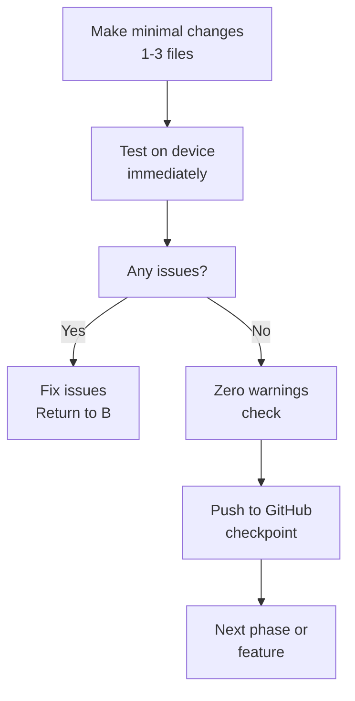

# Route Planning Implementation Strategy

**Last Updated**: October 2025
**Status**: Planning Phase (awaiting Phase 1 implementation)
**Author**: Development Team

## Executive Summary

This document outlines a phased, incremental approach to implementing route planning functionality for the Tern paragliding app. The strategy emphasizes **working functionality first, technical polish second** with rigorous testing at each phase.

## Critical Lessons Learned

### Previous Attempt Issues
- ❌ **Over-engineering**: 38+ files modified simultaneously
- ❌ **Technical focus over UX**: Prioritizing compilation warnings over working features
- ❌ **Complex Redux integration**: Adding state management before basic functionality worked
- ❌ **Scope creep**: Adding weather integration, QR sharing, performance optimization before core features worked

### Corrected Approach
- ✅ **Minimal changes per phase** (1-3 files maximum)
- ✅ **Frequent device testing** (test every change immediately)
- ✅ **Zero warnings before GitHub push** (strict quality gate)
- ✅ **Working functionality first** (technical polish second)
- ✅ **Incremental GitHub pushes** (regular checkpointing)

## Implementation Phases

### Phase 1: Minimal Viable Route Planning (MVP)
**Goal**: Basic waypoint creation and display

**Files to Modify (2-3 maximum)**:
```kotlin
// Essential files only
- Waypoint data model (new file)
- Map touch handling (modify existing)
- Basic waypoint display (modify existing)
```

**Deliverables**:
- [ ] Long press map → Create waypoint at location
- [ ] Display waypoint markers on map
- [ ] Simple waypoint list/information
- [ ] **Test on device** ✅
- [ ] **Zero warnings** ✅
- [ ] **Push to GitHub** ✅

**Success Criteria**:
- Long press creates waypoint
- Waypoint visible on map
- No crashes or warnings
- Manual testing passed

### Phase 2: Route Editing & Redux Integration
**Goal**: Add editing capabilities with state management

**Files to Modify (2-3 maximum)**:
```kotlin
// Focused changes only
- Redux actions for waypoint CRUD
- Route editing mode implementation
- MapViewModel Redux connection
```

**Deliverables**:
- [ ] Drag-and-drop waypoint repositioning
- [ ] Delete waypoints functionality
- [ ] Redux state properly updates
- [ ] **Test on device** ✅
- [ ] **Zero warnings** ✅
- [ ] **Push to GitHub** ✅

### Phase 3: Enhanced Features
**Goal**: Add advanced features incrementally

**Phase 3a: Route Metadata**
- Route names and descriptions
- Basic route validation
- **Test and push**

**Phase 3b: Weather Integration**
- WeatherRouter integration
- Visual weather indicators
- **Test and push**

**Phase 3c: QR Code Sharing**
- iOS-compatible QR generation
- Route export functionality
- **Test and push**

## Quality Gates

### Before Any GitHub Push
- ✅ **Zero compilation warnings**
- ✅ **Functionality works on device**
- ✅ **Manual testing passed**
- ✅ **No regressions in existing features**
- ✅ **Performance targets met** (<10 Redux dispatches/sec, <75% memory usage)

### During Development
1. **Make minimal changes** (1-3 files maximum)
2. **Test on device immediately** after each change
3. **Fix any issues** before adding new functionality
4. **Maintain aviation safety standards**
5. **Ensure zero warnings** before proceeding

## Success Metrics

### Technical Requirements
- ✅ **Builds without warnings or errors**
- ✅ **Installs and launches successfully**
- ✅ **No performance regressions**
- ✅ **Memory usage <75%**

### Functional Requirements
- ✅ **Long press creates waypoints**
- ✅ **AddWaypointButton works**
- ✅ **Route editing functions properly**
- ✅ **Redux state updates correctly**
- ✅ **Visual feedback for user actions**

## Development Workflow



## Architectural Constraints

### Redux Integration
- Only add Redux after basic functionality works
- Use existing Redux patterns (no new architectures)
- Follow AGENTS.md overlay manager requirements
- Maintain aviation safety standards

### Performance Requirements
- <10 Redux dispatches/sec during route operations
- <75% memory usage with adaptive allocation
- Zero visual discontinuity during flight operations
- No UI blocking during critical operations

### Code Quality Standards
- Zero compilation errors OR warnings (strict compliance)
- Follow existing code patterns and conventions
- Maintain backward compatibility
- No regressions in existing functionality

## Related Documentation

- **AGENTS.md** - Strict completion criteria and architectural requirements
- **ARCHITECTURE_DECISIONS.md** - System architecture and patterns
- **AVIATION_SAFETY.md** - Safety standards and requirements
- **PERFORMANCE_GUIDELINES.md** - Performance targets and monitoring

## Future Considerations

### iOS Integration
- QR code format compatibility with iOS Tern app
- Cross-platform route sharing capabilities
- Consistent user experience across platforms

### Competition Features
- FAI-compliant route validation
- Competition route management
- Advanced waypoint types and constraints

### Weather Integration
- WeatherRouter integration for route optimization
- RiskAssessmentEngine for safety analysis
- Visual weather indicators on routes

---

**Ready for Phase 1 implementation!** 🪂