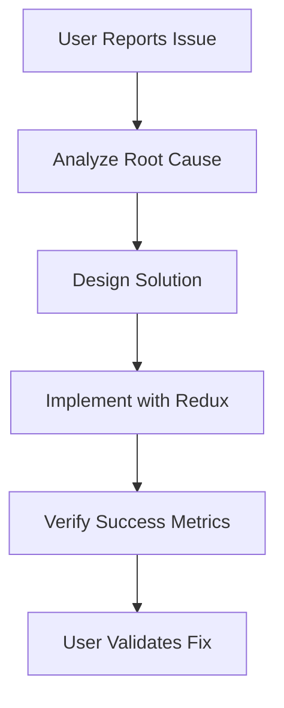
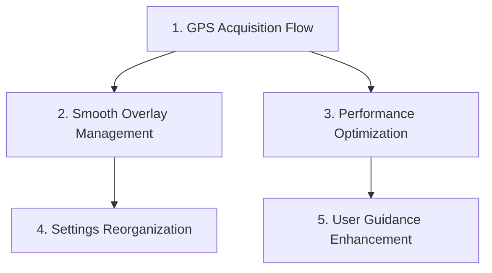

# 💡 Usability Improvement Framework

## 📋 Overview
Systematic approach to improving user experience while maintaining technical excellence.

## 🎯 Usability Improvement Process

### 1. Identify User Problem


### 2. Technical Implementation
- **Redux Integration**: All state changes through Redux actions
- **Performance Compliance**: <10 dispatches/sec, <75% memory
- **Architecture Compliance**: BaseOverlayManager pattern
- **Safety Standards**: Progressive enhancement maintained

## 🚧 Implementation Order

### Priority-Based Implementation


## 📊 Success Verification

### Technical Success Criteria
- [ ] **Code Quality**: Compiles without errors or warnings
- [ ] **Redux Compliance**: All state changes through Redux
- [ ] **Performance Targets**: <10 dispatches/sec, <75% memory
- [ ] **Architecture Compliance**: BaseOverlayManager pattern followed
- [ ] **Safety Standards**: Aviation requirements maintained

### User Experience Success Criteria
- [ ] **Problem Resolution**: Original issue completely solved
- [ ] **No Regression**: Existing features unaffected
- [ ] **Progressive Enhancement**: Works for all user types
- [ ] **Clear Benefit**: Improvement obvious to users

## 🎨 Specific Improvement Patterns

### 1. GPS Acquisition Flow
**Problem**: Welcome screen doesn't wait for GPS → shows 0,0 world map

**Redux Pattern**:
```kotlin
// Add to MapState
val isLocationReady: Boolean = false
val gpsStatus: GpsStatus = GpsStatus.ACQUIRING

// Actions
data class SetLocationReady(val ready: Boolean) : MapAction()
data class UpdateGpsStatus(val status: GpsStatus) : MapAction()

// UI observes state
val isReady by store.state.map { it.isLocationReady }
if (isReady) ShowMap() else ShowWelcomeScreen()
```

### 2. Smooth Overlay Management
**Problem**: Abrupt overlay clearing during navigation

**Distance-Based Pattern**:
```kotlin
enum class ViewportZone { CORE, NEAR, MID, FAR, EXTREME }

fun classifyAirspaceZone(airspace: Airspace, center: GeoPoint): ViewportZone {
    val distance = calculateDistance(airspace.centroid, center)
    return when {
        distance <= 5km -> ViewportZone.CORE
        distance <= 15km -> ViewportZone.NEAR
        distance <= 30km -> ViewportZone.MID
        distance <= 50km -> ViewportZone.FAR
        else -> ViewportZone.EXTREME
    }
}
```

### 3. Performance Optimization
**Problem**: Too many overlays when zoomed out

**Zoom-Based Pattern**:
```kotlin
fun getOptimalOverlayCount(zoom: Double): Int {
    return when {
        zoom >= 12.0 -> maxOverlays // High zoom: full detail
        zoom >= 10.0 -> maxOverlays / 2 // Medium zoom: half
        zoom >= 8.0 -> maxOverlays / 4 // Low zoom: quarter
        else -> maxOverlays / 8 // Very low zoom: minimal
    }
}
```

## 🚦 Quality Gates

### Pre-Implementation Gate
- [ ] **Problem Clearly Defined**: Root cause identified
- [ ] **Solution Architected**: Redux pattern designed
- [ ] **Risk Assessment**: Safety impact evaluated
- [ ] **Success Metrics**: Technical and UX criteria defined

### Post-Implementation Gate
- [ ] **Technical Verification**: Code compiles, performance targets met
- [ ] **Safety Verification**: No aviation safety regression
- [ ] **User Verification**: Problem solved, no new issues introduced
- [ ] **Documentation**: Implementation documented

## 📈 Measurement & Tracking

### Performance Monitoring
```kotlin
object UsabilityMetrics {
    fun recordImprovement(
        improvement: String,
        beforeMetrics: Map<String, Any>,
        afterMetrics: Map<String, Any>
    ) {
        // Track performance impact of each improvement
        Log.d("UsabilityMetrics", "Improvement: $improvement")
        Log.d("UsabilityMetrics", "Performance impact: $afterMetrics")
    }
}
```

### User Experience Metrics
- **Task Completion Time**: How long to achieve user goals
- **Error Rates**: Frequency of user confusion or mistakes
- **Satisfaction Scores**: User feedback on improvements
- **Usage Patterns**: How features are actually used

---

## 💡 Usability Improvement Analogies

**Redux for UX = Traffic Lights**
- Actions = Traffic signals (clear instructions)
- State = Current light color (obvious status)
- Components = Drivers (respond to signals)
- Reducers = Light timing (predictable changes)

**Distance-Based Clearing = Movie Theater**
- Front row = Always visible (CORE zone)
- Middle seats = High priority (NEAR zone)
- Back seats = Remove when crowded (FAR zone)
- Outside = Remove first (EXTREME zone)

**Progressive Enhancement = Aircraft Cockpit**
- Full instruments = Aviation-grade experience
- Backup instruments = Still flyable
- Basic instruments = Safe minimum functionality

This framework ensures systematic, measurable improvements to user experience while maintaining aviation safety and technical excellence.