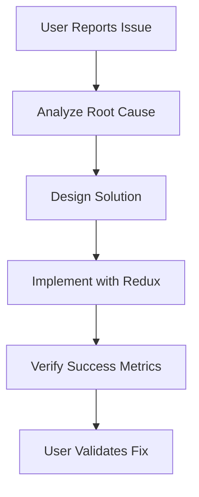
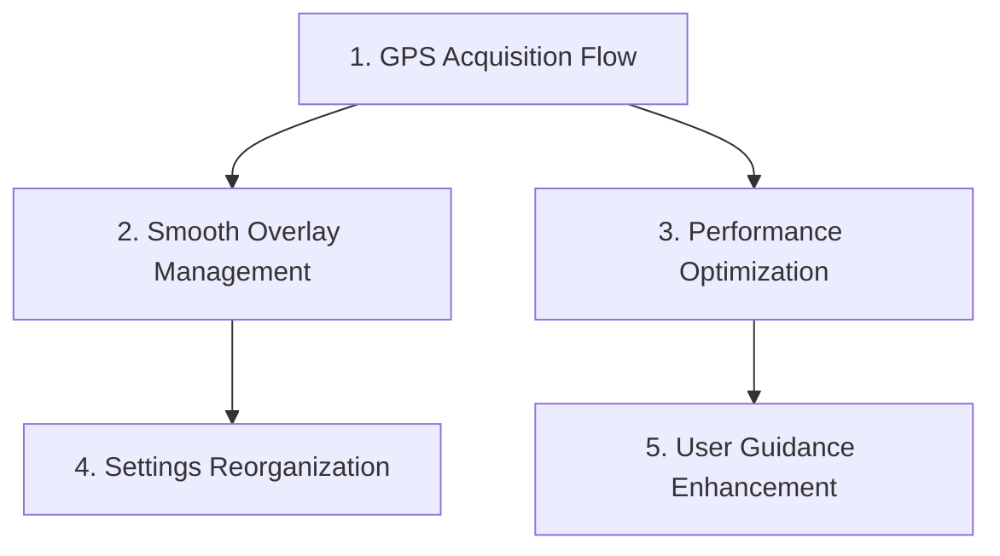

# 💡 Usability Improvement Framework

## 📋 Overview
Systematic approach to improving user experience while maintaining technical excellence.

## 🎯 Usability Improvement Process

### 1. Identify User Problem


### 2. Technical Implementation
- **Redux Integration**: All state changes through Redux actions
- **Performance Compliance**: <10 dispatches/sec, <75% memory
- **Architecture Compliance**: BaseOverlayManager pattern
- **Safety Standards**: Progressive enhancement maintained

## 🚧 Implementation Order

### Priority-Based Implementation


## 📊 Success Verification

### Technical Success Criteria
- [ ] **Code Quality**: Compiles without errors or warnings
- [ ] **Redux Compliance**: All state changes through Redux
- [ ] **Performance Targets**: <10 dispatches/sec, <75% memory
- [ ] **Architecture Compliance**: BaseOverlayManager pattern followed
- [ ] **Safety Standards**: Aviation requirements maintained

### User Experience Success Criteria
- [ ] **Problem Resolution**: Original issue completely solved
- [ ] **No Regression**: Existing features unaffected
- [ ] **Progressive Enhancement**: Works for all user types
- [ ] **Clear Benefit**: Improvement obvious to users

## 🎨 Specific Improvement Patterns

### 1. GPS Acquisition Flow
**Problem**: Welcome screen doesn't wait for GPS → shows 0,0 world map

**Redux Pattern**:
```kotlin
// Add to MapState
val isLocationReady: Boolean = false
val gpsStatus: GpsStatus = GpsStatus.ACQUIRING

// Actions
data class SetLocationReady(val ready: Boolean) : MapAction()
data class UpdateGpsStatus(val status: GpsStatus) : MapAction()

// UI observes state
val isReady by store.state.map { it.isLocationReady }
if (isReady) ShowMap() else ShowWelcomeScreen()
```

### 2. Smooth Overlay Management
**Problem**: Abrupt overlay clearing during navigation

**Distance-Based Pattern**:
```kotlin
enum class ViewportZone { CORE, NEAR, MID, FAR, EXTREME }

fun classifyAirspaceZone(airspace: Airspace, center: GeoPoint): ViewportZone {
    val distance = calculateDistance(airspace.centroid, center)
    return when {
        distance <= 5km -> ViewportZone.CORE
        distance <= 15km -> ViewportZone.NEAR
        distance <= 30km -> ViewportZone.MID
        distance <= 50km -> ViewportZone.FAR
        else -> ViewportZone.EXTREME
    }
}
```

### 3. Performance Optimization
**Problem**: Too many overlays when zoomed out

**Zoom-Based Pattern**:
```kotlin
fun getOptimalOverlayCount(zoom: Double): Int {
    return when {
        zoom >= 12.0 -> maxOverlays // High zoom: full detail
        zoom >= 10.0 -> maxOverlays / 2 // Medium zoom: half
        zoom >= 8.0 -> maxOverlays / 4 // Low zoom: quarter
        else -> maxOverlays / 8 // Very low zoom: minimal
    }
}
```

## 🚦 Quality Gates

### Pre-Implementation Gate
- [ ] **Problem Clearly Defined**: Root cause identified
- [ ] **Solution Architected**: Redux pattern designed
- [ ] **Risk Assessment**: Safety impact evaluated
- [ ] **Success Metrics**: Technical and UX criteria defined

### Post-Implementation Gate
- [ ] **Technical Verification**: Code compiles, performance targets met
- [ ] **Safety Verification**: No aviation safety regression
- [ ] **User Verification**: Problem solved, no new issues introduced
- [ ] **Documentation**: Implementation documented

## 📈 Measurement & Tracking

### Performance Monitoring
```kotlin
object UsabilityMetrics {
    fun recordImprovement(
        improvement: String,
        beforeMetrics: Map<String, Any>,
        afterMetrics: Map<String, Any>
    ) {
        // Track performance impact of each improvement
        Log.d("UsabilityMetrics", "Improvement: $improvement")
        Log.d("UsabilityMetrics", "Performance impact: $afterMetrics")
    }
}
```

### User Experience Metrics
- **Task Completion Time**: How long to achieve user goals
- **Error Rates**: Frequency of user confusion or mistakes
- **Satisfaction Scores**: User feedback on improvements
- **Usage Patterns**: How features are actually used

---

## 💡 Usability Improvement Analogies

**Redux for UX = Traffic Lights**
- Actions = Traffic signals (clear instructions)
- State = Current light color (obvious status)
- Components = Drivers (respond to signals)
- Reducers = Light timing (predictable changes)

**Distance-Based Clearing = Movie Theater**
- Front row = Always visible (CORE zone)
- Middle seats = High priority (NEAR zone)
- Back seats = Remove when crowded (FAR zone)
- Outside = Remove first (EXTREME zone)

**Progressive Enhancement = Aircraft Cockpit**
- Full instruments = Aviation-grade experience
- Backup instruments = Still flyable
- Basic instruments = Safe minimum functionality

## 🎯 Handedness-Aware UI Design

### Overview
Adaptive UI system that optimizes control placement based on user handedness for improved paragliding safety and usability.

### Core Principles

#### Control Prioritization Matrix
| Control Type | Interaction | Placement | Visual Weight | Example |
|-------------|-------------|-----------|---------------|---------|
| **Critical** | Emergency, primary flight | Thumb-reachable zone | High contrast, large | Emergency button, map zoom |
| **Important** | Navigation, weather | Index-reachable zone | Medium contrast | Layer toggles, route tools |
| **Secondary** | Status, visual info | Any area | Low contrast, small | Compass, altitude tape |
| **Tertiary** | Settings, menu | Hidden/minimal | Minimal | Settings, help menu |

#### Handedness-Based Layout Strategy

**Right-Handed Pilots:**
```
┌─────────────────────────────────────┐
│ [A] Emergency Button     [B] Menu   │  ← Critical: Right-thumb zone
│ [C] Map Zoom +/-         [D] Compass│  ← Important: Index-reachable
│ [E] Weather Toggle       [F] Info   │  ← Secondary: Visual-only
│ [G] Settings             [H] Status │  ← Tertiary: Background
└─────────────────────────────────────┘
```

**Left-Handed Pilots:**
```
┌─────────────────────────────────────┐
│ [B] Compass    [A] Emergency Button │  ← Critical: Left-thumb zone
│ [D] Info       [C] Map Zoom +/-     │  ← Important: Index-reachable
│ [F] Status     [E] Weather Toggle   │  ← Secondary: Visual-only
│ [H] Settings   [G] Menu             │  ← Tertiary: Background
└─────────────────────────────────────┘
```

### Privacy-First Detection Strategy

#### Detection Hierarchy
1. **User Selection** (Primary) - Most accurate, privacy-safe
2. **System Settings** (Secondary) - No behavioral tracking
3. **Smart Default** (Fallback) - Educated guess from device config

#### Implementation Pattern
```kotlin
class PrivacySafeHandednessManager {
    fun detectHandedness(): HandednessInfo {
        return when {
            // 1. Check user preference first
            userHasSelectedHandedness() -> getUserHandedness()

            // 2. Try system detection (current settings only)
            canDetectFromSystem() -> detectFromSystemSettings()

            // 3. Smart default (no user data)
            else -> getSmartDefault()
        }
    }
}
```

#### System Detection Methods (Privacy-Safe)
- **Accessibility Services**: Check for handedness-related services
- **Input Method Preferences**: Keyboard/input configuration
- **Device Configuration**: Foldable status, screen size
- **No Usage Tracking**: Only reads current system state

### Flight-Phase Awareness

#### Adaptive Layouts by Flight Phase

| Flight Phase | Critical Controls | Layout Priority |
|-------------|------------------|-----------------|
| **Launch** | Emergency, wind check | Right-handed bias for launch prep |
| **Thermal** | Emergency, thermal info | Balanced for thermal hunting |
| **Glide** | Emergency, landing calc | Navigation-focused layout |
| **Landing** | Emergency, landing tools | Safety-critical placement |
| **Cruise** | Emergency, weather | Comfort-optimized for long flights |

### Technical Architecture

#### Redux State Integration
```kotlin
data class UserPreferencesState(
    val handedness: Handedness = Handedness.RIGHT_HANDED,
    val handednessSource: HandednessSource = HandednessSource.SMART_DEFAULT,
    val adaptiveLayout: AdaptiveLayoutConfig = AdaptiveLayoutConfig()
)

enum class HandednessSource {
    USER_SELECTED,      // User explicitly chose
    SYSTEM_DETECTED,    // From system settings
    SMART_DEFAULT       // Educated guess
}
```

#### Layout Calculation Engine
```kotlin
class AdaptiveLayoutEngine {
    fun calculateOptimalLayout(
        handedness: Handedness,
        flightMode: FlightMode,
        screenSize: Size
    ): LayoutConfig {
        // Calculate zones based on:
        // - Handedness preference
        // - Flight mode requirements
        // - Thumb reach ergonomics
        // - Safety priorities
    }
}
```

### Safety Considerations

#### Aviation-Specific Requirements
- **Emergency Access**: Critical controls always thumb-reachable
- **Visual Clarity**: Information hierarchy supports safety decisions
- **One-Handed Operation**: All flight-critical functions accessible single-handedly
- **Progressive Enhancement**: Graceful degradation if handedness unknown

#### Risk Mitigation
- **Fallback Layouts**: Default to most common handedness if detection fails
- **Override Capability**: Users can change handedness anytime
- **Context Validation**: Different layouts for different flight phases
- **User Confirmation**: Always allow user to override automatic detection

### Implementation Benefits

#### For Paragliding Safety
- **Optimized Control Reach**: Critical controls in natural thumb zones
- **Reduced Cognitive Load**: Information hierarchy matches mental models
- **Enhanced Situational Awareness**: Visual elements don't compete with controls
- **Emergency Response**: Critical functions always accessible during flight

#### Privacy Protection
- **No Behavioral Tracking**: Only system settings, no usage monitoring
- **User Control**: Explicit consent and override capability
- **Transparent Algorithm**: Clear reasoning for handedness decisions
- **Minimal Data Collection**: Only stores user's final preference

This framework ensures adaptive UI design enhances paragliding safety while maintaining user privacy and technical excellence.