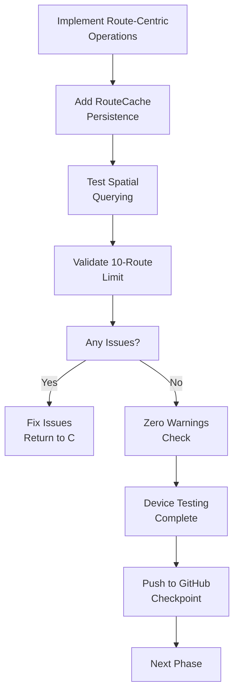

# Route Planning Implementation Strategy

**Last Updated**: October 2025
**Status**: Technical Architecture Complete, UX Implementation Pending
**Author**: Development Team

## Executive Summary

This document outlines the **route-centric implementation strategy** for the Tern paragliding app, combining the phased approach from the original specification with the validated technical architecture. The strategy emphasizes **route-centric data management** with **airspace cache-like persistence** and **working functionality first, Redux polish second**.

## Critical Architecture Decisions

### Route-Centric Data Management ✅ **IMPLEMENTED**
- **✅ CONFIRMED**: Routes own their waypoints (strong data relationships)
- **✅ CONFIRMED**: RouteCache mimics AirspaceCache with flat buffer storage
- **✅ CONFIRMED**: Hilbert spatial indexing for efficient route queries
- **✅ CONFIRMED**: 10-route limit with distance-based spatial filtering
- **✅ CONFIRMED**: Memory-mapped I/O for zero-copy route loading

### Redux Integration Strategy
- **Phase 1**: ViewModel-based state management (WaypointStore) ✅ **CURRENT**
- **Phase 2**: Redux migration only after UI interactions work perfectly
- **✅ DO**: Avoid Redux anti-patterns during development
- **❌ AVOID**: Redux-first architecture before working features

## Implementation Phases

### Phase 1: Route-Centric Waypoint Management (MVP)
**Goal**: Implement route-centric waypoint operations with airspace cache-like persistence

**Architecture**: RouteCache with flat buffer storage and spatial indexing
**Files to Modify (3-4 maximum)**:
```kotlin
// Essential files for route-centric implementation
- RouteCache.kt (mimic AirspaceCache pattern)
- RouteCacheManager.kt (10-route limit, spatial queries)
- MapViewContainer.kt (update waypoint operations)
- Route.kt (add waypoint management methods)
```

**Deliverables**:
- [ ] **RouteCache**: Flat buffer storage with Hilbert indexing (mimic AirspaceCache)
- [ ] **Route-Centric Operations**: Waypoints owned by routes, not global store
- [ ] **Spatial Querying**: Query routes by map center (300-mile default radius)
- [ ] **10-Route Limit**: Maximum stored routes with distance-based filtering
- [ ] **Memory-Mapped I/O**: Zero-copy route loading for performance
- [ ] **Test on device** ✅
- [ ] **Zero warnings** ✅
- [ ] **Push to GitHub** ✅

**Success Criteria**:
- Routes persist across app restarts using flat buffer storage
- Spatial queries return routes within 300 miles of map center
- Maximum 10 routes stored with Hilbert curve spatial indexing
- Route-centric operations work (waypoints owned by routes)
- No performance degradation from route persistence

### Phase 2: Redux Migration & Advanced Features
**Goal**: Migrate to Redux architecture and add advanced capabilities

**Prerequisites**: Phase 1 must be fully working and tested
**Architecture**: Migrate from RouteCache to Redux (RouteState, RouteActions, RouteReducers)
**Files to Modify (2-3 maximum)**:
```kotlin
// Redux migration files
- RouteState, RouteActions, RouteReducers (new files)
- Redux bridge to sync with RouteCache
- RouteOverlayManager extending BaseOverlayManager
```

**Deliverables**:
- [ ] Redux state management implementation
- [ ] RouteOverlayManager for map visualization
- [ ] Redux bridge maintains RouteCache compatibility
- [ ] Advanced waypoint management features
- [ ] **Test on device** ✅
- [ ] **Zero warnings** ✅
- [ ] **Push to GitHub** ✅

### Phase 3: Enhanced Features
**Goal**: Add advanced features incrementally

**Phase 3a: Route Metadata**
- Route names and descriptions
- Basic route validation
- **Test and push**

**Phase 3b: Weather Integration**
- WeatherRouter integration
- Visual weather indicators
- **Test and push**

**Phase 3c: QR Code Sharing**
- iOS-compatible QR generation
- Route export functionality
- **Test and push**

## Route Persistence Architecture

### AirspaceCache-Like Design
```kotlin
// RouteCache mimics AirspaceCache pattern
class RouteCache(private val context: Context) {
    // Directory: context.cacheDir/route_cache/
    // Files: route_001.flex, route_001.idx, route_002.flex, route_002.idx
    // Index: cache_index (timestamps), spatial_index (Hilbert)
    // Memory-mapped buffers for zero-copy I/O
    // 10-route limit with spatial querying
}

// Spatial Querying (300-mile default radius)
fun getNearbyRoutes(center: GeoPoint, radiusMiles: Double = 300.0): List<Route> {
    // 1. Calculate Hilbert index for map center
    // 2. Query flat buffer using memory-mapped I/O
    // 3. Apply distance filter (Hilbert is approximate)
    // 4. Return routes sorted by distance
}

// Centroid Calculation for Spatial Indexing
fun calculateRouteCentroid(route: Route): GeoPoint {
    val lats = route.waypoints.map { it.lat }
    val lons = route.waypoints.map { it.lon }
    return GeoPoint(lats.average(), lons.average())
}
```

### Flat Buffer Structure
```kotlin
// route_XXX.flex (FlexBuffer format)
{
  "routeId": "route_001",
  "name": "Morning Flight",
  "waypoints": [/* serialized waypoint data */],
  "metadata": {
    "centroid": {"lat": 46.5, "lon": 6.8},
    "hilbertIndex": 12345,
    "boundingBox": {"minLat": 46.0, "maxLat": 47.0, "minLon": 6.0, "maxLon": 7.0}
  }
}

// route_XXX.idx (Hilbert spatial index)
{
  "spatialIndex": {
    "bits": 16,
    "entries": [{"hilbertIndex": 12345, "byteOffset": 0, "byteLength": 512}]
  }
}
```

## Quality Gates

### Before Any GitHub Push
- ✅ **Zero compilation warnings**
- ✅ **Functionality works on device**
- ✅ **Manual testing passed**
- ✅ **No regressions in existing features**
- ✅ **Performance targets met** (<10 Redux dispatches/sec, <75% memory usage)
- ✅ **Route persistence working** (flat buffer storage)
- ✅ **Spatial queries functional** (300-mile radius)

### During Development
1. **Make minimal changes** (1-3 files maximum)
2. **Test on device immediately** after each change
3. **Fix any issues** before adding new functionality
4. **Maintain aviation safety standards**
5. **Ensure zero warnings** before proceeding

## Success Metrics

### Technical Requirements
- ✅ **Builds without warnings or errors**
- ✅ **Installs and launches successfully**
- ✅ **No performance regressions**
- ✅ **Memory usage <75%**
- ✅ **Route persistence with flat buffer storage**
- ✅ **Spatial indexing with Hilbert curves**

### Functional Requirements
- ✅ **Long press creates waypoints in routes**
- ✅ **Routes persist across app restarts**
- ✅ **Spatial queries work for route discovery**
- ✅ **10-route limit enforced**
- ✅ **Redux state updates correctly** (Phase 2)
- ✅ **Visual feedback for user actions**

## Route-Centric Update Flow

### Waypoint Operations
```kotlin
// ADD Waypoint
MapViewContainer → Route.addWaypoint() → RouteCache.persistRoute() → RouteOverlayManager.updateVisuals()

// MODIFY Waypoint (Drag)
MapViewContainer → Route.updateWaypoint() → RouteCache.updateSpatialIndex() → RouteOverlayManager.redrawRoute()

// DELETE Waypoint
MapViewContainer → Route.removeWaypoint() → RouteCache.persistRoute() → RouteOverlayManager.removeMarker()

// QUERY Routes
MapViewContainer → RouteCache.queryNearbyRoutes() → Spatial Filter → UI Display
```

### State Management
```kotlin
// Current: RouteCache (Phase 1)
Route Operations → RouteCache → Flat Buffer Storage → Spatial Index

// Future: Redux + RouteCache (Phase 2)
Route Operations → Redux Actions → RouteCache Sync → StateFlow Updates
```

## Development Workflow



## Architectural Constraints

### Route-Centric Architecture
- **Phase 1**: RouteCache with flat buffer storage (mimic AirspaceCache)
- **10-Route Limit**: Maximum routes stored with spatial filtering
- **Hilbert Indexing**: 16-bit precision spatial indexing for performance
- **Memory-Mapped I/O**: Zero-copy loading for route data
- **300-Mile Radius**: Default spatial query distance

### Performance Requirements
- **Route Queries**: Sub-second response for 300-mile radius queries
- **Memory Usage**: <75% during route operations
- **Spatial Updates**: <100ms for centroid and Hilbert index calculation
- **Persistence**: Background I/O with atomic operations
- **Redux Ready**: Architecture prepared for Phase 2 Redux migration

### Code Quality Standards
- Zero compilation errors OR warnings (strict compliance)
- Follow existing AirspaceCache patterns for consistency
- Maintain backward compatibility during migration
- No regressions in existing functionality
- Aviation safety standards throughout all phases

## Related Documentation

- **AGENTS.md** - Updated route-centric architecture and Redux migration strategy
- **ARCHITECTURE_DECISIONS.md** - System architecture and caching patterns
- **AVIATION_SAFETY.md** - Safety standards and performance requirements
- **PERFORMANCE_GUIDELINES.md** - Performance targets and monitoring

## Future Considerations

### Redux Migration (Phase 2)
- RouteCache becomes Redux state backing store
- Redux actions sync with RouteCache operations
- Gradual migration from simple store to Redux pattern
- Maintain RouteCache for performance-critical operations

### iOS Integration
- RouteCache format compatible with iOS Tern app
- Cross-platform route sharing capabilities
- Consistent spatial indexing across platforms

### Competition Features
- FAI-compliant route validation
- Competition route management
- Advanced waypoint types and constraints

---

**Ready for Phase 1 implementation with route-centric architecture!** 🪂